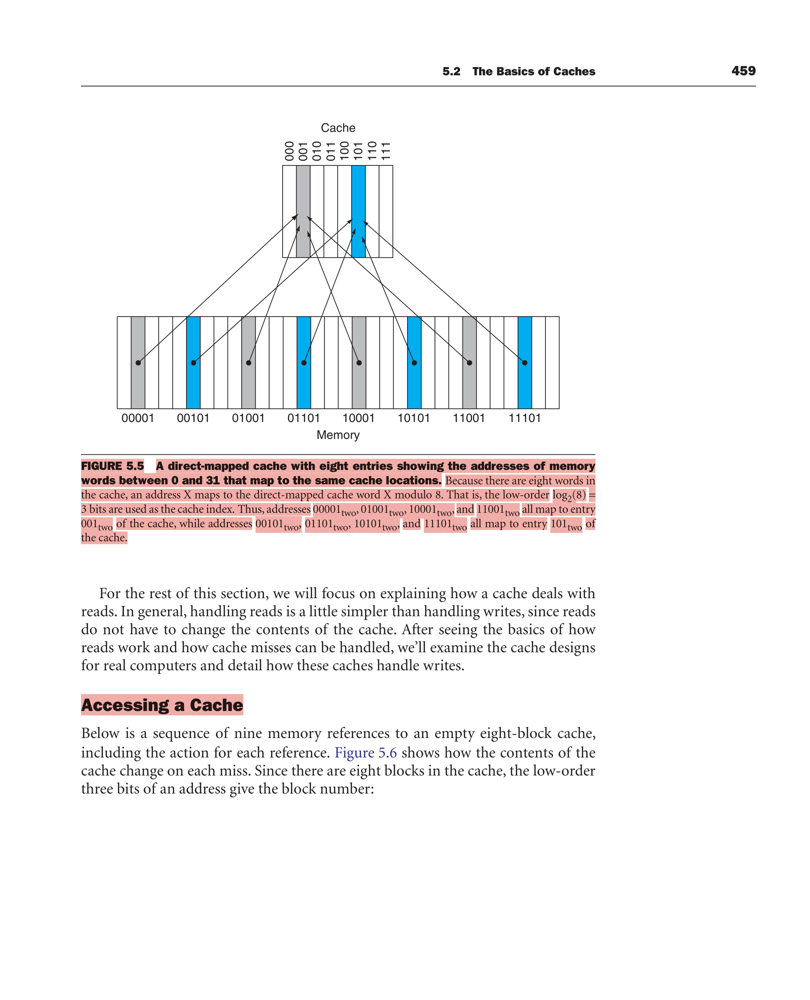
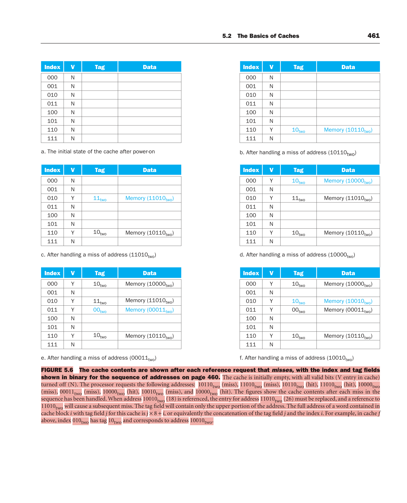
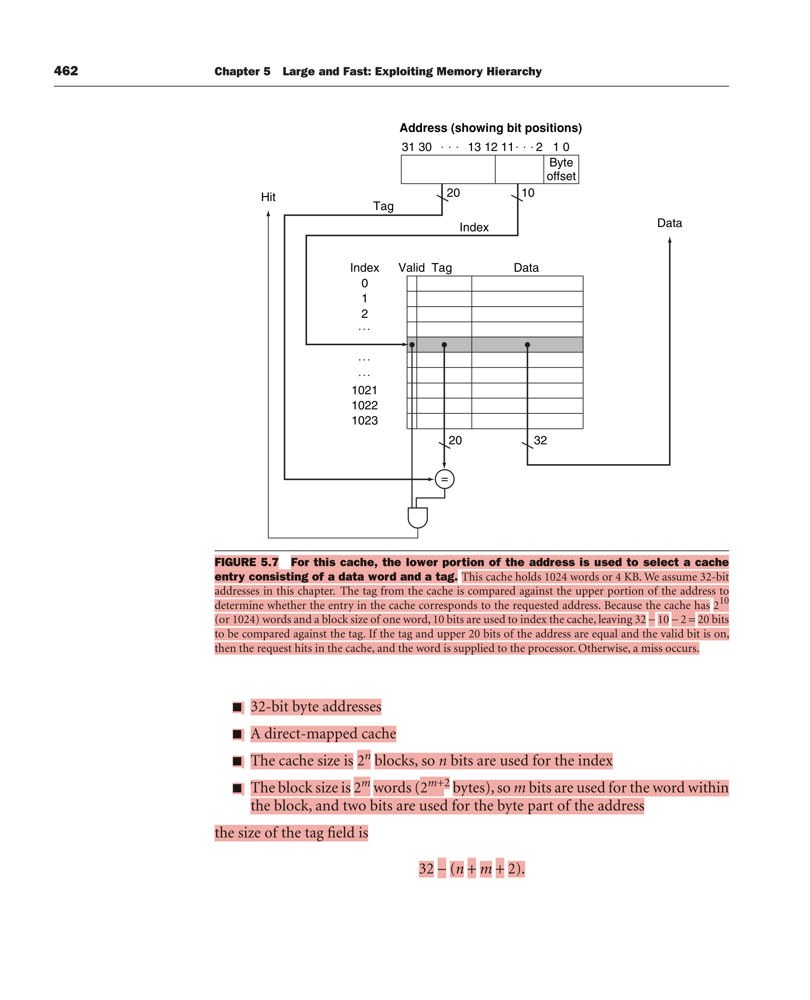
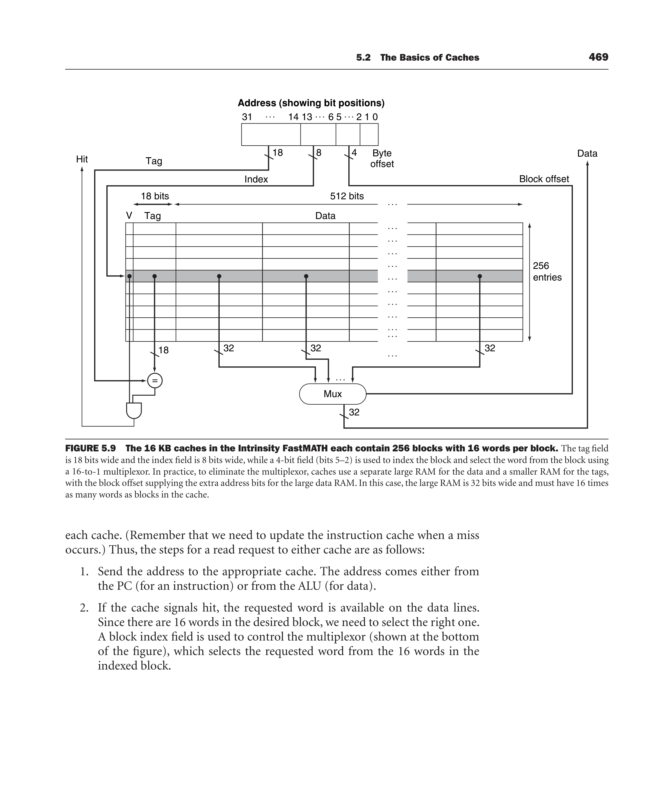
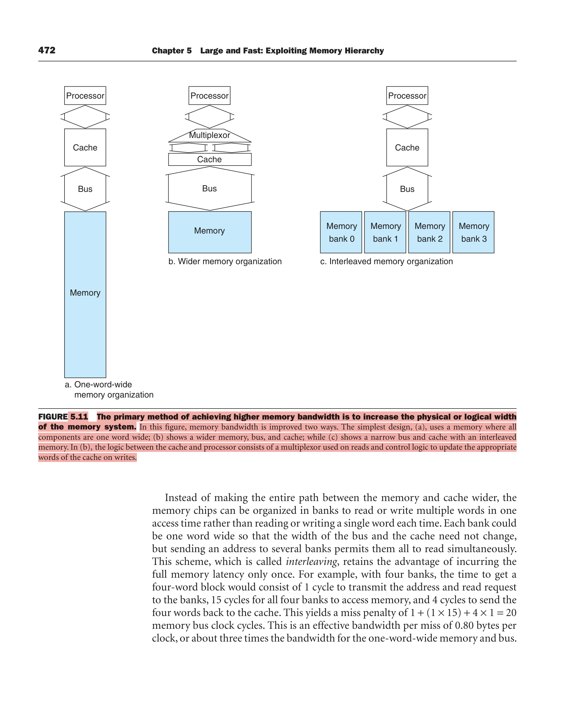
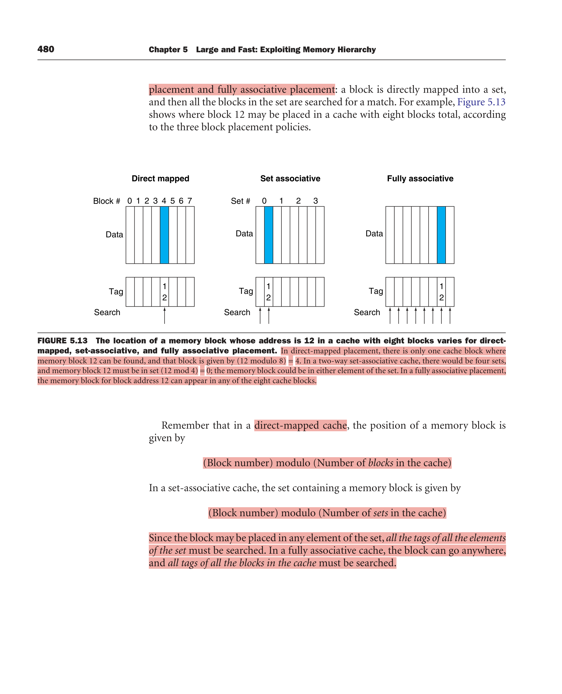
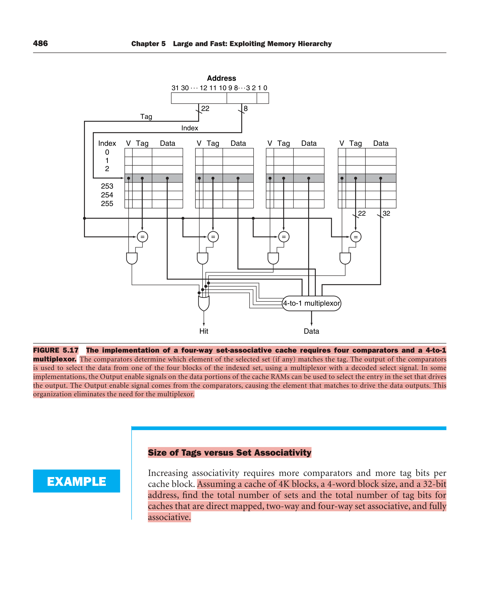

# Ch 5.1–5.3: Memory Hierarchy & Caches (midterm)

P&H 4e, book pp. 452–492. Figure links open the textbook page render (some have your highlights).
🎯 = has appeared in a past paper or is copied from a textbook example. ⚠️ = small print he could pull a trick question from.

---

## 5.1 Introduction: locality and the hierarchy

**Principle of locality:** programs access a relatively small portion of their address space at any instant.

| | Definition (book wording) | Program example | How the hierarchy exploits it |
|---|---|---|---|
| **Temporal** (locality in time) 🎯 | if an item is referenced, it tends to be referenced **again soon** | loops (same instructions, same loop variables) | keep **recently accessed** items close to the processor |
| **Spatial** (locality in space) 🎯 | if an item is referenced, items whose **addresses are close by** tend to be referenced soon | sequential instructions, arrays, records | move **blocks of multiple contiguous words** up the hierarchy |

Library analogy: the desk = cache, the books on the desk = blocks. Books on the same topic are shelved together, which is spatial locality.

**Memory hierarchy:** multiple levels with different speeds and sizes. Farther from the CPU means bigger, slower and cheaper per bit.

| Technology (2008) | Access time | $ per GB | Used for |
|---|---|---|---|
| SRAM | 0.5–2.5 ns | $2000–5000 | caches |
| DRAM | 50–70 ns | $20–75 | main memory |
| Magnetic disk | 5,000,000–20,000,000 ns (5–20 ms) | $0.20–2 | lowest level (flash in embedded) |

Why DRAM is cheaper: it uses **less area per bit**, so more capacity per chip.

Vocabulary (all definitions are exam-able):
- **Block / line**: minimum unit of information that can be either present or not present in a level.
- **Hit rate (hit ratio)**: fraction of accesses found in the upper level. **Miss rate = 1 − hit rate.**
- **Hit time** ⚠️: time to access the upper level, **including the time to determine whether it is a hit or a miss**.
- **Miss penalty** ⚠️: time to fetch the block from the lower level. That includes accessing the block, transmitting it, inserting it into the level that missed, **and passing it to the requestor**.
- Data is copied between **only two adjacent levels at a time** (upper = closer to CPU).
- ⚠️ **True hierarchy / inclusion**: data cannot be present in level *i* unless it is also present in level *i+1*. Each level is a subset of the one below, and **all data is stored at the lowest level**.

⚠️ **Check Yourself 5.1** ("which are generally true?"):
1. Caches take advantage of temporal locality. **TRUE**
2. On a read, the value returned depends on which blocks are in the cache. **FALSE** (the cache is invisible to correctness; only *speed* changes)
3. Most of the cost of the memory hierarchy is at the highest level. **FALSE** (in 2008 the biggest cost is usually the DRAM)
4. Most of the capacity is at the lowest level. **TRUE**

---

## 5.2 The basics of caches

### Direct mapped 🎯
Each memory location maps to **exactly one** cache location:

```
cache index = (block address) mod (number of blocks in cache)
```
If #blocks is a power of 2, the mod is just the **low log2(#blocks) bits** of the block address. 8 blocks → the low 3 bits.

- **Tag**: the upper address bits, stored to identify *which* memory block is sitting there. ⚠️ The index bits are **not** stored in the tag because they are redundant: the index of a slot is, by definition, that slot's number.
- **Valid bit**: is this entry holding real data? At power-on every entry is N (invalid), so the tags are garbage.
- ⚠️ Because the index is an n-bit field, the **number of entries in a direct-mapped cache must be a power of 2**.
- ⚠️ MIPS words are aligned to 4 bytes, so the **2 LSBs = byte offset** are ignored when selecting a word.
- Full address of the word in slot *i* with tag *j* = **j × 8 + i** (8-block cache), i.e. tag concatenated with index.



### 🎯 THE trace: Fig 5.6 (TT2-2025 Q2 was this exact table)
8-block direct-mapped cache, 1-word blocks, word addresses, initially empty:

| Addr (dec) | Binary | Index = low 3 bits | Tag = high 2 bits | Result |
|---|---|---|---|---|
| 22 | 10110 | 110 | 10 | miss (cold) |
| 26 | 11010 | 010 | 11 | miss (cold) |
| 22 | 10110 | 110 | 10 | **hit** |
| 26 | 11010 | 010 | 11 | **hit** |
| 16 | 10000 | 000 | 10 | miss |
| 3 | 00011 | 011 | 00 | miss |
| 16 | 10000 | 000 | 10 | **hit** |
| 18 | 10010 | 010 | 10 | miss: **replaces 26 (11010)** since both want index 010 |
| 16 | 10000 | 000 | 10 | **hit** |

Final state:
```
Index V Tag  Data
000   Y 10   Memory(10000)
001   N
010   Y 10   Memory(10010)   <- 11010 was evicted
011   Y 00   Memory(00011)
100   N
101   N
110   Y 10   Memory(10110)
111   N
```
Book's point: replacing 26 with 18 exploits **temporal locality** (recent words replace less recent ones). In DM there is **only one choice** of what to replace.



**TT2-2025 version** (starts from state "e" minus 00011, then reads 00011, 10010, 00011):
- (a) read 00011 → index 011, V = N → **miss** (compulsory/cold). Fetch from memory, set V=Y, tag=00, data=Mem(00011).
- (b) read 10010 → index 010 holds tag 11 ≠ 10 → **miss** (conflict). **Replace** Mem(11010) with Mem(10010), tag ← 10.
- (c) read 00011 → index 011, V=Y, tag 00 = 00 → **hit**. Nothing changes.
- Final = the table above.

**How to write a trace answer for full marks:** for every access write (1) binary, (2) index and tag split, (3) the check done ("V=Y, stored tag 11 ≠ 10"), (4) hit or miss, (5) what changed in the table. Draw the final table.

### Address breakdown 🎯
```
| tag | index | block offset (word) | byte offset |
  ^       ^            ^                 ^
 rest  log2(#sets)  log2(words/block)    2 (MIPS)
```
Book's formula (32-bit byte address, 2^n blocks, 2^m words/block): **tag = 32 − (n + m + 2)**.

**Total bits** in a DM cache = 2^n × (block size in bits + tag size + 1 valid bit)
= 2^n × (2^m × 32 + 31 − n − m).
⚠️ Naming convention: a "4 KB cache" counts **data only**, not tags or valid bits.

🎯 **Example: bits in a cache.** 16 KB data, 4-word blocks, 32-bit address.
16 KB = 4K words = 2^12 words → 2^10 = 1024 blocks. Tag = 32 − 10 − 2 − 2 = 18.
Total = 2^10 × (128 + 18 + 1) = 2^10 × 147 = **147 Kbits ≈ 18.4 KB**, about **1.15×** the data alone.

🎯 **Example: mapping a byte address to a multiword block.** 64 blocks, 16 bytes/block. Where does byte 1200 go?
Block address = ⌊1200 / 16⌋ = **75**. Cache block = 75 mod 64 = **11**. That block holds bytes **1200–1215**.
(block = ⌊addr/bytes per block⌋, covering addresses block×B … block×B + B − 1)



### Block size trade-off ⚠️ (classic "explain" question)
- Larger blocks exploit **spatial locality** and **lower the miss rate**.
- But if the block becomes a significant fraction of the cache size, there are **too few blocks**, more competition, blocks get bumped before their words are used, and the **miss rate goes UP** (Fig 5.8).
- The bigger problem: the **miss penalty grows** (latency to the first word + **transfer time for the rest**). Eventually the higher miss penalty outweighs the lower miss rate.
- Larger blocks also mean **less tag storage per data bit** (an efficiency plus).

Hiding transfer time (Elaboration):
- **Early restart**: resume as soon as the *requested word* arrives, don't wait for the whole block. Works best for **instruction** access (sequential). Less effective for data.
- **Requested word first / critical word first**: memory sends the requested word **first**, then the rest wrapping around. Slightly faster than early restart.

### Handling a cache miss ⚠️
- A miss causes a **pipeline stall**, **not an interrupt** (an interrupt would require saving all registers; a stall just freezes them).
- **Instruction miss steps:**
  1. Send the **original PC value (current PC − 4)** to memory (the PC was already incremented).
  2. Tell main memory to read, then **wait**.
  3. Write the cache entry: data, upper address bits → tag, **valid bit on**.
  4. **Restart** the instruction at the first step (refetch, which now hits).
- Data miss: the same idea, just stall until memory responds.

### Handling writes 🎯 (syllabus says "Handling writes included")
Problem: if a store writes only the cache, the cache and memory are **inconsistent**.

| | **Write-through** | **Write-back** (copy-back) |
|---|---|---|
| On a write | update **cache AND next lower level** | update **cache only** |
| Memory updated | every write | when the **modified (dirty) block is replaced** |
| Consistency | memory always current | memory can be stale |
| Speed | slow without a buffer (each write ~100 cycles) | fast, good when CPU writes faster than memory can absorb |
| Complexity | simple | **more complex** (needs a dirty bit; stores take 2 cycles or a store buffer) |
| Store in 1 cycle? | **yes**: write the data and check the tag in parallel (if wrong, memory still has the true copy) | **no**: must check for a hit first, or a write could destroy a dirty block that isn't backed up below |

⚠️ **Why write-through alone is terrible** (book's numbers): 10% stores, CPI 1.0, 100 cycles per write → CPI = 1 + 100 × 10% = **11**, more than 10× slower.

**Write buffer:** a queue that holds data waiting to be written to memory. The CPU writes into the cache and the buffer, then continues.
- If the buffer is **full**, the CPU **stalls**.
- If memory's write rate < the CPU's write-generation rate, **no amount of buffering helps**.
- Stalls can still occur when writes come in **bursts**, which is why buffers are made deeper than 1 entry.

**Write miss policies** (Elaboration) 🎯🎯:
- **Write allocate**: on a write miss, **fetch the block into the cache**, then overwrite the word. The most common choice.
- **No write allocate**: update the block **in memory only**; don't bring it into the cache.
  - Motivation ⚠️: programs sometimes **write entire blocks**, e.g. **the OS zeroing a page**. Fetching the block first would be wasted work.
  - Some computers let you change the allocation policy **per page**.
- Natural pairings (from the lecture slides + past paper "why do we combine write-through with no-write-allocate?"):
  - **write-back + write-allocate**: later writes to the block then hit in the cache and cost nothing extra.
  - **write-through + no-write-allocate**: every write goes to memory anyway, so allocating on a write miss buys nothing unless the block is *read* later.

**Write-back buffer** ⚠️: when a miss replaces a dirty block, move the dirty block into a buffer, read the new block, then write the buffer back later. This **halves the miss penalty** when a dirty block must be replaced (if no second miss follows immediately).

### Real example: Intrinsity FastMATH (⚠️ numbers are trick material)
- Embedded MIPS processor, **12-stage pipeline**.
- Requests an instruction word **and** a data word every clock → **separate I-cache and D-cache** (split cache).
- Each cache **16 KB = 4K words, 16-word blocks** → **256 blocks**.
- Address split: **tag 18 | index 8 | block offset 4 (bits 5–2) | byte offset 2**. A 16-to-1 mux selects the word (real designs use separate tag/data RAMs instead).
- Writes: offers **both write-through and write-back**, the **OS decides** per application. **One-entry write buffer.**
- Miss rates (SPEC2000): **instruction 0.4%, data 11.4%, combined 3.2%**.



**Split vs combined (unified) cache** ⚠️🎯 (past paper: "differences between separate and unified cache"):
- A **combined cache** of the same total size usually has a **better hit rate**, because it doesn't rigidly divide entries between instructions and data. 32 KB: split 3.24% vs combined **3.18%**.
- But **split doubles cache bandwidth** (an instruction and a data access in the same cycle), which outweighs the slightly worse miss rate.
- Lesson: **miss rate is not the sole measure** of cache performance.
- *Split cache* = one level made of two independent caches operating in parallel, one for instructions, one for data.

### Designing memory to support caches (bandwidth) ⚠️🎯
Assume 1 bus cycle to send the address, **15** bus cycles per DRAM access, 1 bus cycle to send a word. Block = 4 words.

| Organisation | Miss penalty | Bytes / bus cycle |
|---|---|---|
| (a) **One-word-wide** memory and bus | 1 + 4×15 + 4×1 = **65** | 16/65 = **0.25** |
| (b) **Wider** memory and bus (2 words) | 1 + 2×15 + 2×1 = **33** | **0.48** |
| (c) **Interleaved**: 4 one-word banks, 1-word bus | 1 + 1×15 + 4×1 = **20** | **0.80** (~3×) |

- Wider memory costs: a wider bus, plus a **mux/control between cache and CPU** that may increase cache access time.
- **Interleaving** pays the access latency only **once**, and banks help **writes** too (each bank writes independently).
- **DDR** (double data rate) = transfers on **both rising and falling clock edges**. Internally organised as interleaved banks.
- **SDRAM** = synchronous DRAM; the clock removes memory–processor synchronisation time. **Burst** transfers read sequential locations from the row buffer without a new row access.
- RAM organisation **d × w** (depth × width). DRAM access = row access + column access.
- **Stream benchmark** = measures the memory system behind the caches (long vectors, **no temporal locality**, arrays bigger than the cache).



⚠️ **Check Yourself 5.2**: valid guidelines are **(1) shorter memory latency → smaller block** (less latency to amortise) and **(4) higher memory bandwidth → larger block** (the miss penalty only grows slightly).

---

## 5.3 Measuring & improving cache performance

### Formulas 🎯
```
CPU time = (CPU execution cycles + Memory-stall cycles) × Clock cycle time
Memory-stall cycles = Read-stall + Write-stall
Read-stall  = (Reads/Program) × Read miss rate × Read miss penalty
Write-stall = (Writes/Program × Write miss rate × Write miss penalty) + Write buffer stalls
Simplified (WT, negligible buffer stalls, same penalties):
Memory-stall cycles = (Memory accesses/Program) × Miss rate × Miss penalty
                    = (Instructions/Program) × (Misses/Instruction) × Miss penalty
AMAT = Hit time + Miss rate × Miss penalty
```
⚠️ Write-buffer stalls can be **ignored** if the buffer is **≥ 4 words deep** and memory accepts writes at **≥ 2×** the average write rate. Otherwise, the book says, the design is bad: use a deeper buffer or write-back.
⚠️ Hit time is normally counted as part of normal CPU execution cycles.

🎯 **Example: calculating cache performance.** I-cache miss rate 2%, D-cache 4%, CPI 2 without stalls, miss penalty 100, loads + stores = 36%.
- Instruction miss cycles = I × 2% × 100 = **2.00 I** (every instruction is fetched)
- Data miss cycles = I × 36% × 4% × 100 = **1.44 I**
- Stalls = 3.44 per instruction → CPI = 2 + 3.44 = **5.44**
- Perfect cache is **5.44 / 2 = 2.72× faster**.
- ⚠️ Follow-up: improve the pipeline to CPI 1 (memory unchanged) → CPI 4.44, perfect cache now **4.44× faster**. The stall share of time rises from 3.44/5.44 = **63%** to 3.44/4.44 = **77%**. That's Amdahl's law: speed up the CPU but not the memory, and memory dominates. The same happens if you raise the clock rate.

⚠️ A **larger cache** can have a **longer hit time**, maybe adding a pipeline stage. At some point the hit-time increase beats the hit-rate improvement.

🎯 **Example: AMAT.** 1 ns clock, miss penalty 20 cycles, miss rate 0.05, hit time 1 cycle → AMAT = 1 + 0.05×20 = **2 cycles = 2 ns**.

### Placement: direct mapped ↔ set associative ↔ fully associative 🎯🎯

| | Where a block can go | Finding it | Hardware |
|---|---|---|---|
| **Direct mapped** | exactly **one** place: (block addr) mod (#blocks) | index, then compare 1 tag | **1 comparator** |
| **n-way set associative** | any of **n** places in **one set**: set = (block addr) mod (#sets) | index the set, then search n tags **in parallel** | **n comparators + n-to-1 mux** |
| **Fully associative** | **anywhere** | search **all** tags in parallel, **no index** | **a comparator per entry**, only practical for small caches |

- ⚠️ Set-associative is "fixed number of locations (**at least two**)".
- **Direct mapped = 1-way set associative.** **Fully associative with m entries = m-way set associative** (one set).
- Total blocks = #sets × associativity. For a fixed size, doubling associativity **halves the sets, index −1 bit, tag +1 bit**.
- 🎯 Past paper: "n-way set associative with m sets. n when DM? when FA?" → **DM: n = 1. FA: m = 1, so n = total number of blocks.**

🎯 **Fig 5.13: memory block 12 in an 8-block cache**
- DM → block **12 mod 8 = 4**
- 2-way (4 sets) → set **12 mod 4 = 0**, either element
- Fully associative → **any of the 8**



🎯 **Advantages of fully associative over direct mapped** (TT2-2025 Q1b):
- A block can be placed **anywhere** → **no conflict misses** (two hot blocks never fight over one slot). **Lowest miss rate** for a given size.
- Full **freedom of replacement**: the cache can use LRU etc. to evict the block least likely to be needed.
- Disadvantages: every tag must be searched, so **one comparator per entry** (hardware cost, power), potentially **longer hit time**. Only practical for small caches (TLBs!) or with CAMs.

🎯 **Example: misses and associativity.** 3 caches of **4 one-word blocks**, block addresses **0, 8, 0, 6, 8**:

| Cache | Mapping | Trace | Misses |
|---|---|---|---|
| Direct mapped | 0→0, 8→0, 6→2 | M M M M M (0 and 8 keep evicting each other) | **5** |
| 2-way (2 sets) | all map to set 0 | M M **H** M M (6 replaces 8 = LRU, then 8 replaces 0) | **4** |
| Fully assoc | anywhere | M M **H** M **H** | **3** (best possible: 3 distinct blocks) |

⚠️ With **8 blocks** the 2-way cache would have no replacements (same as FA). With **16 blocks** all three give the same misses. **Cache size and associativity aren't independent.**

Associativity payoff (Fig 5.15, 64 KB D-cache, 16-word blocks): 1-way **10.3%** → 2-way **8.6%** → 4-way **8.3%** → 8-way **8.1%**. **1→2-way gives about 15% fewer misses; little gain after that.** Main disadvantage of more associativity: **potentially longer hit time** (+ cost).

### Locating a block (set associative)
`| Tag | Index | Block offset |`. Index selects the **set**; tags of all blocks in the set are compared **in parallel** (sequential search would make the hit time too slow).
⚠️ 4-way needs **4 comparators and a 4-to-1 multiplexor** (Fig 5.17, 256 sets, 22-bit tag, 8-bit index).



⚠️ **CAM (Content Addressable Memory)**: you supply data and it returns the matching row index (comparison + storage in one device). In 2008: **2-way and 4-way** built from SRAM + comparators, **8-way and above** use CAMs.

### Choosing which block to replace
- DM: no choice.
- Associative: **LRU (least recently used)**, replace the block unused for the longest time. Exploits temporal locality.
- ⚠️ 2-way LRU = **a single bit per set**. Harder as associativity grows (Section 5.5 gives an alternative: random). Lecture slides also list **FIFO, Random, Optimal (Belady)**; Optimal is theoretical only.
- 🎯 Past paper "one scheme to pick the block to replace in fully associative" → **LRU** (or random).

🎯 **Example: size of tags vs set associativity.** 4K blocks, 4-word (16-byte) blocks, 32-bit address → 28 bits for index + tag.

| Organisation | Sets | Index bits | Tag bits | Total tag bits |
|---|---|---|---|---|
| Direct mapped | 4K | 12 | 16 | 16 × 4K = **64 K** |
| 2-way | 2K | 11 | 17 | 17 × 2 × 2K = **68 K** |
| 4-way | 1K | 10 | 18 | 18 × 4 × 1K = **72 K** |
| Fully assoc | 1 | 0 | 28 | 28 × 4K = **112 K** |

🎯 Past paper: **128 KB cache, 16-byte blocks, 4-way → index size?** 128K/16 = 8192 blocks, /4 = 2048 sets → **11-bit index**.

### Multilevel caches (reduce miss PENALTY)
L2 is usually on the same chip and is accessed on an L1 miss. If L2 has the data, the L1 miss penalty ≈ L2 access time.

🎯 **Example: performance of multilevel caches.** Base CPI 1.0, **4 GHz** (0.25 ns), main memory **100 ns**, L1 miss rate **2%** per instruction. Add L2: **5 ns** access, global miss rate to memory **0.5%**.
- Memory penalty = 100 / 0.25 = **400 cycles**. L1 only: CPI = 1 + 2% × 400 = **9**
- L2 penalty = 5 / 0.25 = **20 cycles**
- With L2: CPI = 1 + 2% × 20 + 0.5% × 400 = 1 + 0.4 + 2.0 = **3.4**
- Speedup = 9 / 3.4 = **2.6**
- Alternative bookkeeping: hits in L2 (2% − 0.5%) × 20 = 0.3; go to memory 0.5% × (20 + 400) = 2.1; 1 + 0.3 + 2.1 = 3.4 ✓

Design differences ⚠️ (Check Yourself 5.3 answer = **1**):
- **L1 focuses on hit time** (shorter clock or fewer pipe stages). It is **smaller**, possibly **smaller blocks**.
- **L2 focuses on miss rate** (to soften long memory latency). It is **much larger**, can use **larger blocks** and **higher associativity**.
- L2 is often ≥ **10×** larger than L1. L2 access is typically < 10 cycles, memory > 100 cycles.

⚠️ **Global vs local miss rate**:
- **Global miss rate** = fraction of references that miss in **all** levels (0.5% above).
- **Local miss rate** of L2 = L2 misses / **accesses to L2** = 0.5% / 2% = **25%!** Much higher than global because L1 filters out the easy, local accesses. The **global** rate decides how often you go to memory.

⚠️ **Understanding Program Performance: Radix Sort vs Quicksort** (Fig 5.18). Radix sort executes **fewer instructions** per item for large arrays, but has **many more cache misses**, so it's **slower in clock cycles**. Algorithm analysis that ignores the memory hierarchy is misleading.

⚠️ Out-of-order processors: memory-stall cycles / instr = misses/instr × (**total miss latency − overlapped miss latency**). Needs simulation. Rule of thumb: an L1 miss that hits in L2 is often hidden; an L2 miss rarely is.
⚠️ **Autotuning**: libraries that search parameter space at runtime to fit a particular machine's cache.

**Summary of 5.3 in one breath:** miss *rate* is reduced by associativity, miss *penalty* by multilevel caches. Fully associative is too costly when large; set associative is the practical middle.

---

## Past-paper problems, solved (verified with `practice/cachelib.py`)

### 🎯 Final 2024 Q6a: 64-bit address, Tag 63–10 | Index 9–5 | Offset 4–0
Offset 5 bits → **32-byte blocks**. Index 5 bits → **32 blocks** (direct mapped, 1 KB of data).
Byte address → offset = addr mod 32, index = ⌊addr/32⌋ mod 32, tag = ⌊addr/1024⌋.

| Hex | Dec | Tag | Index | Offset | H/M | Replaced |
|---|---|---|---|---|---|---|
| 00 | 0 | 0 | 0 | 0 | M | – |
| 04 | 4 | 0 | 0 | 4 | **H** | |
| 10 | 16 | 0 | 0 | 16 | **H** | |
| 84 | 132 | 0 | 4 | 4 | M | – |
| E8 | 232 | 0 | 7 | 8 | M | – |
| A0 | 160 | 0 | 5 | 0 | M | – |
| 400 | 1024 | 1 | 0 | 0 | M | bytes 0–31 (tag 0) |
| 1E | 30 | 0 | 0 | 30 | M | bytes 1024–1055 (tag 1) |
| 8C | 140 | 0 | 4 | 12 | **H** | |
| C1C | 3100 | 3 | 0 | 28 | M | bytes 0–31 |
| B4 | 180 | 0 | 5 | 20 | **H** | |
| 884 | 2180 | 2 | 4 | 4 | M | bytes 128–159 |

**Hit ratio = 4/12 = 33.3%.**

### 🎯 Final 2024 (21-22) Q3b: 64 KB memory, 4 KB cache, 16-byte blocks, byte-addressable
State your assumption: **direct mapped** (not given). 64 KB → **16-bit address**. Offset = log2 16 = **4**, lines = 4K/16 = 256 → index **8**, tag = 16 − 12 = **4**.
In hex this is neat: **tag = 1st hex digit, index = middle 2 hex digits, offset = last hex digit.**

| Addr | Tag | Index | Off | H/M |
|---|---|---|---|---|
| 0000 | 0 | 00 | 0 | M |
| 0004 | 0 | 00 | 4 | **H** (same block as 0000) |
| 0010 | 0 | 01 | 0 | M |
| 0400 | 0 | 40 | 0 | M |
| 0000 | 0 | 00 | 0 | **H** |
| 0410 | 0 | 41 | 0 | M |
| 0800 | 0 | 80 | 0 | M |
| 0004 | 0 | 00 | 4 | **H** |
| 0C00 | 0 | C0 | 0 | M |
| 0010 | 0 | 01 | 0 | **H** |

6 misses, 4 hits, **no replacements**: every tag is 0, so nothing conflicts. Final valid lines: 00, 01, 40, 41, 80, C0 (all tag 0).

### 🎯 Write-allocate vs no-write-allocate (both finals)
Fully associative **write-back**, "many entries" (never evicts), **initially empty**. Reads always allocate.

**Sequence A:** W[100], W[100], R[200], W[200], W[100]

| Op | No-write-allocate | Write-allocate |
|---|---|---|
| W 100 | miss (not loaded) | miss (loaded) |
| W 100 | **miss** (still not in cache) | hit |
| R 200 | miss (loaded, reads allocate) | miss |
| W 200 | hit | hit |
| W 100 | miss | hit |
| **Total** | **4 misses, 1 hit** | **2 misses, 3 hits** |

**Sequence B:** R[400], W[500], R[100], W[400], R[500]
- Empty start: **NWA: 4 misses, 1 hit** (only W400 hits). **WA: 3 misses, 2 hits** (W400 and R500 hit).
- If "start with address 400" means 400 is *already* cached: NWA 3 M / 2 H, WA 2 M / 3 H. **State your assumption.**

### 🎯 Split 16 KB I + 16 KB D vs unified 32 KB (old final Q3a-ii)
Misses per 1000 instructions: I-16KB 3.82, D-16KB 40.9, unified-32KB 43.3. 36% of instructions are loads/stores. Hit = 1 cycle, penalty = 100. Unified: +1 cycle for a load/store (single port conflict).
- Refs per instruction = 1 + 0.36 = 1.36. Instruction refs fraction = 1/1.36 = **74%**, data **26%**.
- Miss rates: I = 3.82/1000/1.00 = **0.004**. D = 40.9/1000/0.36 = **0.114**. Split overall = 0.74×0.004 + 0.26×0.114 = **0.0326**.
- Unified = 43.3/1000/1.36 = **0.0318** → *unified has the lower miss rate*.
- AMAT split = 0.74(1 + 0.004×100) + 0.26(1 + 0.114×100) = **4.24**
- AMAT unified = 0.74(1 + 0.0318×100) + 0.26(**1 + 1** + 0.0318×100) = **4.44**
- **Split wins on AMAT** despite the higher miss rate. This is the same lesson as the FastMATH elaboration.
