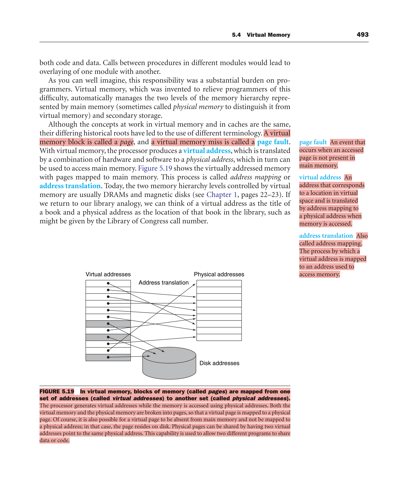
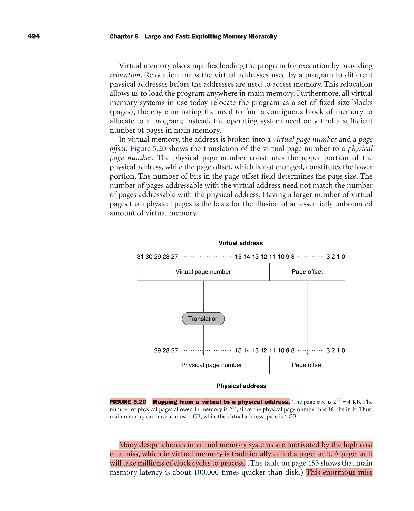
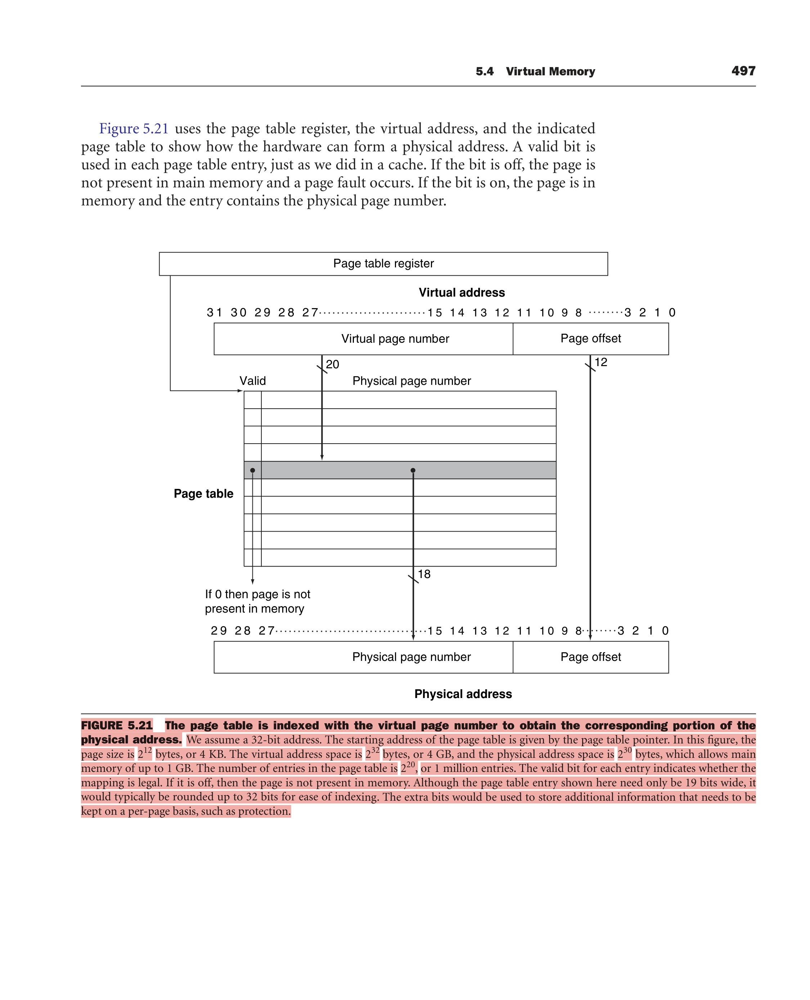
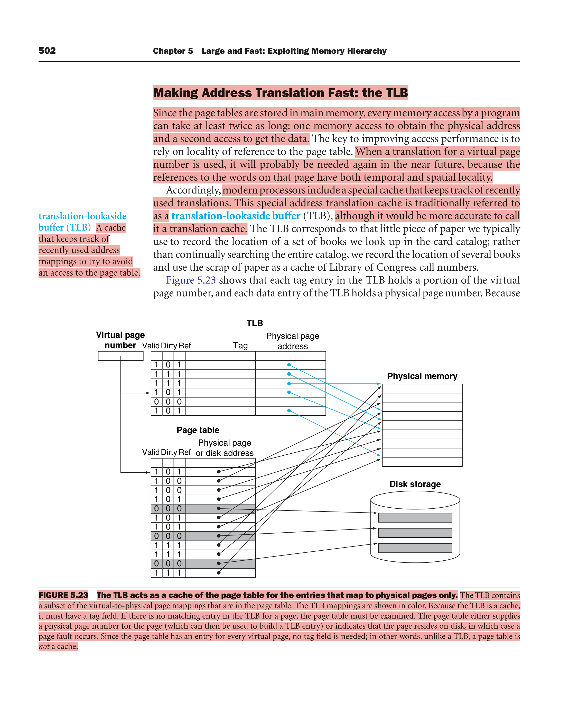
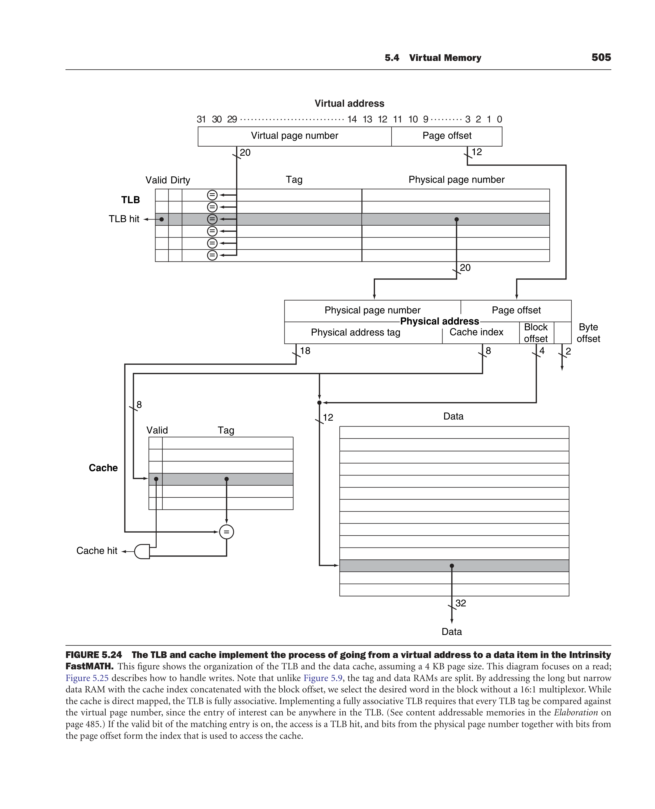
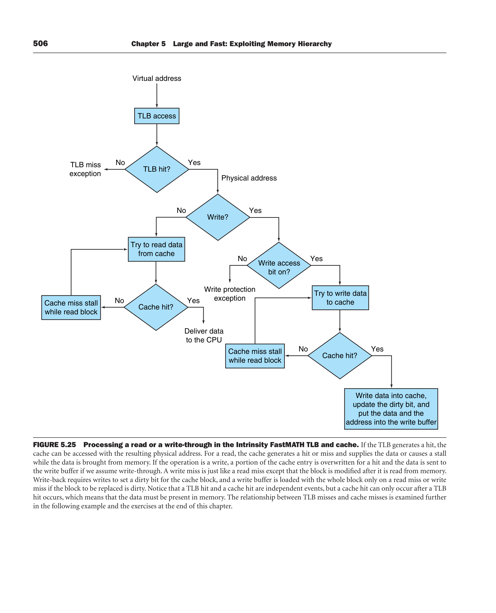

# Ch 5.4: Virtual Memory (midterm)

P&H 4e, book pp. 492–517. 🎯 = past paper / textbook example. ⚠️ = small print.

**One-line idea:** main memory acts as a **"cache" for secondary storage (disk)**. The same principle of locality, one level down.

---

## Why virtual memory? (two motivations) ⚠️
1. **Efficient and safe sharing of memory among multiple programs** (protection). ← **this is the one that dominates today** (book: "it's the former reason that reigns today").
2. **Remove the burden of a small, limited main memory**: let one program exceed physical memory. Before VM, programmers used **overlays** (they split programs into mutually exclusive pieces and loaded/unloaded them by hand).

Plus: **relocation**. A program can be loaded **anywhere** in physical memory, and since it's done in fixed-size pages the OS doesn't need a **contiguous** chunk, just enough free pages.

Each program is compiled into its **own address space**. VM translates it to physical addresses, and that translation **enforces protection**.

## Terminology map (cache word → VM word)

| Cache | Virtual memory |
|---|---|
| block | **page** |
| miss | **page fault** |
| address | **virtual address** → translated to **physical address** |
| mapping | **address translation / address mapping** |
| upper / lower level | main memory (DRAM) / disk |

Library analogy: virtual address = **book title**, physical address = **location in the library (call number)**. The page table = the card catalogue. The TLB = the scrap of paper where you jot down the call numbers of the books you keep looking up.



## Address translation 🎯
```
Virtual address:   | virtual page number (VPN) | page offset |
                              │ translate              │ unchanged
Physical address:  | physical page number (PPN)| page offset |
```
- **Page offset is not translated.** Its bit count sets the page size (12 bits → 4 KB).
- Number of virtual pages **need not equal** number of physical pages. More virtual than physical = the illusion of unbounded memory.
- 🎯 **Fig 5.20/5.21**: 32-bit VA, **4 KB pages** (12-bit offset) → **20-bit VPN**. PPN **18 bits** → PA = 30 bits → **max 1 GB physical**, while the virtual space is **4 GB**. Page table has **2^20 ≈ 1 million entries**. An entry needs only 19 bits (18 PPN + valid) but is **rounded up to 32 bits**; the extra bits hold protection etc.



### Key design decisions, all driven by the HUGE miss penalty ⚠️🎯
A page fault takes **millions of clock cycles** (DRAM is ~**100,000×** faster than disk).
1. **Pages are large** to amortise the long access time: **4–16 KB** typical. Servers are moving to 32/64 KB; embedded goes the other way, to **1 KB**.
2. **Fully associative placement** of pages, to reduce the page fault rate.
3. Page faults are handled **in software** (by the OS). The overhead is tiny compared with the disk time, and clever algorithms pay for themselves.
4. **Write-back, never write-through**: disk writes take millions of cycles, so even a write buffer can't hide them.

⚠️ **Segmentation** (Elaboration) = **variable-size** blocks. Address = segment number + segment offset. Needs a **bounds check**. Used for protection and sharing. Disadvantage: the address space is split into logically separate pieces, a **two-part address** that programmers and compilers must see. **Paging** makes the page-number/offset boundary **invisible**.

---

## Page table 🎯
- **Lives in main memory.** Indexed by the **VPN**, gives the **PPN**.
- **Each process has its own page table** (different processes use the same virtual addresses).
- **Page table register** points to the start of the current process's page table.
- **Valid bit**: off → page is **not in memory** → **page fault**.
- ⚠️ **No tags needed**: the page table has an entry for **every** virtual page, so the whole VPN is the "index". **A page table is NOT a cache; the TLB is.**
- ⚠️ **Process state** = **page table + PC + registers**. To switch processes the OS just reloads the **page table register** (it doesn't copy the table). Active process = has the processor.



### Page faults
- Valid bit off → **exception** → the OS takes control.
- The OS needs to know **where the page is on disk**, which the VA doesn't tell you. When it creates a process, the OS reserves **swap space** on disk for all of its pages and keeps a structure recording where each virtual page lives on disk (Fig 5.22: one logical table holds a PPN **or** a disk address).
- The OS also tracks **which processes and virtual addresses use each physical page**.
- **Replacement: LRU**, approximated. Exact LRU is too expensive (it would need updating on every reference), so hardware provides a **reference bit (use bit)**, set on access. The OS **periodically clears** these bits and later checks which were set. Lecture slides call one version the **clock algorithm** (second chance).
- Replaced pages are written to **swap space**.

**What the OS does on a page fault (3 steps)** ⚠️:
1. Look up the PTE with the virtual address and **find the page on disk**.
2. **Choose a physical page to replace**. If it's **dirty**, write it to disk first.
3. **Start a read** of the referenced page from disk into that physical page.

Meanwhile the OS runs **another process**. When the read completes, it restores the faulting process and executes the return-from-exception, and the faulting instruction **re-executes**.

### ⚠️ Page table size and how to shrink it (Elaboration) 🎯
**32-bit VA, 4 KB pages, 4 bytes/PTE** → 2^32 / 2^12 = **2^20 entries** × 4 B = **4 MB per process**. Hundreds of processes, or 64-bit addresses, make this hopeless.

Five techniques:
1. **Limit register**: restricts table size, and it grows as the process uses more pages. Needs the address space to grow in **one direction** only.
2. **Two page tables / two limits**: the **stack grows down, the heap grows up**, so the address space is split into 2 segments selected by the **high-order bit**. **MIPS uses this.** Bad for **sparse** address spaces.
3. **Inverted page table**: **hash** the VA so the table is only as big as the number of **physical** pages. Lookup is more complex (you can't just index).
4. **Multiple levels of page tables** 🎯: a first-level ("segment") table maps big chunks (64–256 pages). Each valid entry points to a second-level page table. **Supports sparse address spaces without allocating the entire table.** Disadvantage: **more complex (slower) translation**.
5. **Paged page tables**: page tables live in **virtual** memory themselves. Avoid infinite page-fault loops by keeping some OS page tables in always-present, physically addressed memory.

🎯 **"What is a multi-level page table and why is it necessary?"** → see technique 4. Necessary because a flat table for a large VA (e.g. 48/64-bit) is enormous (see the worked example below: **16 GB** per process!), while most of the address space is **unused**. Multi-level only allocates tables for regions actually in use.

### Writes: dirty bit ⚠️
- **Write-back**, because disk writes are millions of cycles and write-through would be "completely impractical".
- Bonus: disk **transfer** time is small compared with **access** time, so copying back a whole page is **much more efficient** than writing words individually.
- **Dirty bit** (in the page table) is set when **any word in the page is written**. When replacing, a dirty page must be written to disk; a clean one can just be overwritten. A modified page = **dirty page**.

---

## TLB: making translation fast 🎯🎯
Without a TLB, every access needs **two memory accesses**: one to read the PTE, one for the data.

**TLB (translation-lookaside buffer)** = a **cache of recently used translations** ("a translation cache"). It relies on locality of the page-table references.
- **Tag** = (part of) the VPN, **data** = the PPN, plus **valid, dirty, reference** bits (and protection bits).
- On a **TLB hit**: form the PA, set the reference bit (and the dirty bit if writing).
- On a **TLB miss**: is it a page fault or just a TLB miss?
  - Page **in memory** (PTE valid) → load the translation from the page table into the TLB and **retry**.
  - Page **not in memory** → **true page fault** → OS via exception.
- ⚠️ **TLB misses are much more frequent than page faults** (the TLB has far fewer entries than there are pages in memory).
- TLB misses can be handled **in hardware or software**, with little performance difference.
- ⚠️ When a TLB entry is replaced, copy its **reference and dirty bits back** to the PTE. Those are the only parts of a TLB entry that change. This is **write-back** (copy on miss/replacement, not on every write).

**Typical TLB values** ⚠️ (great MCQ material):
| Parameter | Typical |
|---|---|
| Size | **16–512 entries** |
| Block size | 1–2 PTEs (4–8 bytes each) |
| Hit time | **0.5–1 clock cycle** |
| Miss penalty | **10–100 clock cycles** |
| Miss rate | **0.01%–1%** |

- Associativity: small **fully associative** TLBs (low miss rate, affordable since small) or large TLBs with small associativity.
- Replacement: hardware LRU is too expensive for FA, and software is too slow for something this frequent → **random** replacement support.



### Intrinsity FastMATH TLB ⚠️
- 4 KB pages, 32-bit addresses → **20-bit VPN**. PA same size as VA.
- **16 entries, fully associative, shared between instructions and data.**
- Each entry **64 bits**: 20-bit tag (VPN), 20-bit PPN, valid, dirty, other bits.
- TLB miss is handled **in software** (MIPS): hardware saves the page number in a special register and raises an exception. Takes about **13 clock cycles**.
- Replacement: a hardware index recommends an entry chosen **randomly**.
- Writes check the **write access bit**; if off → exception (protection).
- The cache is **direct mapped** while the **TLB is fully associative** (Fig 5.24).



### Read/write flow (Fig 5.25) ⚠️
VA → TLB access → *TLB hit?* no → **TLB miss exception**. Yes → PA → *write?*
- read: cache hit? yes → deliver data. No → **cache miss stall** while the block is read.
- write: **write access bit on?** no → **write protection exception**. Yes → cache hit? → write data into cache, update the dirty bit, put data + address into the write buffer (write-through case).

⚠️ "**A TLB hit and a cache hit are independent events, but a cache hit can only occur after a TLB hit**" (the data must be in memory).



### 🎯 Fig 5.26: the 7 combinations (TLB / page table / cache)

| TLB | Page table | Cache | Possible? |
|---|---|---|---|
| hit | hit | miss | **Possible**, although the page table is never really checked if the TLB hits |
| miss | hit | hit | **Possible**: TLB misses, entry found in the PT; after retry the data is in the cache |
| miss | hit | miss | **Possible**: TLB misses, found in the PT; after retry the data misses in the cache |
| miss | miss | miss | **Possible**: TLB miss followed by a page fault; after retry the data **must** miss in the cache |
| hit | miss | miss | **Impossible**: can't have a translation in the TLB if the page isn't in memory |
| hit | miss | hit | **Impossible**: same reason |
| miss | miss | hit | **Impossible**: data can't be in the cache if the page isn't in memory |

(The 8th combo, hit/hit/hit, is the normal case, so it's not listed.)

### Integrating VM with caches: PIPT / VIVT / VIPT ⚠️🎯
- The OS keeps the hierarchy: when a page migrates to disk, it **flushes that page from the cache** and fixes the page table and TLB.
- **Physically indexed, physically tagged (PIPT)**: translate first, then access the cache. Access time = TLB + cache (can be pipelined).
- **Virtually addressed cache (virtually indexed, virtually tagged)**: the TLB is out of the critical path (**faster**), but on a miss you still translate. Problem: **aliasing**, where two virtual addresses name the same physical page, so one word can sit in **two** cache places and one program's write isn't seen by the other.
- **Virtually indexed, physically tagged (VIPT)**: the common compromise. Index with the **page offset** (which is really physical because it's untranslated) and compare physical tags. **No alias problem.** It needs **careful coordination between the page size, cache size and associativity**. FastMATH really has **16 KB** pages so it can do this.

🎯 **Old final Q: "Given 4 KB pages, how many bytes can a 16-way set-associative VIPT cache hold?"**
In VIPT the **index + block offset must fit inside the page offset** (12 bits), so each way can be at most one page = 4 KB.
**Max cache = associativity × page size = 16 × 4 KB = 64 KB.**

### Protection ⚠️
"Perhaps the most important function of VM": share one memory among processes while **one renegade process can't write** into another's space or the OS.
Hardware must provide **3 basic capabilities**:
1. **At least two modes**: **user** vs **supervisor** (= kernel = executive) mode.
2. Processor state a user process can **read but not write**: the **user/supervisor mode bit, the page table pointer, and the TLB**. Only special supervisor-mode instructions write them.
3. A way to switch modes: user → supervisor via a **system call** exception (`syscall` in MIPS); the PC is saved in the **EPC**. Back via **ERET** (return from exception), which restores user mode and jumps to the EPC.

- Page tables are kept in the **OS's protected address space**, so the OS can change them but a user process can't.
- Different processes map to **disjoint physical pages**, so they can't read each other's data.
- **Sharing**: P2 asks the OS to add a PTE in P1's table pointing to P2's physical page. The **write access bit** can restrict this to read-only. ⚠️ Access-right bits must be in **both the page table and the TLB** (the page table is only consulted on a TLB miss).

⚠️ **Context switch and the TLB** (Elaboration): switching from P1 to P2 means you must **clear P1's TLB entries** (protection, plus P2 needs its own). With a high switch rate that is inefficient. Fix: add a **process identifier / address space ID (ASID)** to the TLB tag. FastMATH has an **8-bit ASID**. A TLB hit then requires the page number **and** the ASID to match → no flush needed.

### Handling TLB misses & page faults (MIPS details) ⚠️
- The exception must be raised **by the end of the same clock cycle** as the memory access. Otherwise e.g. `lw $1,0($1)` would **overwrite $1** and the instruction couldn't be restarted. For stores, **deassert the memory write control line**.
- **EPC** holds the PC of the faulting instruction.
- While saving state the OS is vulnerable (a second exception would overwrite the EPC), so the hardware **disables exceptions** on entry. The OS saves **EPC and Cause**, then re-enables them.
- MIPS control registers (coprocessor 0): **EPC (14)** restart point, **Cause (13)**, **BadVAddr (8)** faulting address, Index (0), **Random (1)**, EntryLo (2) physical page + flags, EntryHi (10) virtual page, **Context (4)** page table address + page number.
- **TLB miss handler at `8000 0000hex`**. The **general exception entry is `8000 0180hex`**. A TLB miss gets its own special entry point to make the frequent case fast.
- TLB miss handler (5 instructions, about a dozen cycles):
  ```
  TLBmiss: mfc0 $k1,Context   # address of PTE
           lw   $k1,0($k1)    # load PTE
           mtc0 $k1,EntryLo   # into EntryLo
           tlbwr              # write TLB entry at Random
           eret               # return
  ```
  ⚠️ It **does not check the valid bit**. If the PTE is invalid, the retry causes a different exception (page fault). This makes the frequent case (TLB miss) fast.
- **$k0, $k1** are reserved for the OS (no save needed), mainly so the TLB miss handler is fast.
- On a page fault the OS saves the **entire state** (GPRs, page table address register, EPC, Cause; FP registers are left to the handlers that need them).
- **Unmapped** region: VA `8000 0000hex`–`BFFF FFFFhex` can't page fault. The upper bits are ignored, so it maps to low physical memory. Exception entry code and the exception stack live there.
- **Restartable instruction**: can resume after an exception without the exception affecting the result. Easy in MIPS (each instruction writes **one** data item, at the **end**). Hard in **x86** (block-move instructions touch thousands of words) → they must be **continued mid-stream**, saving special state.
- Data page faults are hard because they (1) occur **in the middle** of instructions, (2) the instruction **can't complete** before handling, (3) it must be **restarted as if nothing happened**.

### Understanding program performance ⚠️
- **Thrashing**: continuously swapping pages between memory and disk because a program uses more virtual memory than there is physical memory. Fix: more memory, or improve locality.
- **Working set** = the set of popular pages.
- **TLB reach**: a 64-entry TLB × 4 KB = only **0.25 MB** directly accessible without TLB misses. Fix: **variable page sizes** (MIPS supports 4 KB, 16 KB, 64 KB, 256 KB, 1 MB, 4 MB, 16 MB, 64 MB, 256 MB). Radix sort suffers TLB misses.

⚠️ **Check Yourself 5.4** (matching): L1 cache → **a cache for a cache**. L2 cache → **a cache for main memory**. Main memory → **a cache for disks**. TLB → **a cache for page table entries**.

---

## Formulas & solved past-paper problems 🎯

**Bits:** offset = log2(page size). VPN bits = VA bits − offset. PPN bits = PA bits − offset.
**#PTEs** = 2^(VPN bits). **Page table size** = #PTEs × PTE size.
**Effective access time** (lecture slide): EAT = hit time + page fault rate × page fault penalty.
Slide example: 100 ns, fault rate 0.0001% = 10⁻⁶, penalty 10 ms = 10⁷ ns → 100 + 10 = **110 ns**.

### 🎯 Old final Q6c: 48-bit VA, physical memory 4 GB, page size 64 KB
- PA bits = log2(4 GB) = **32**. Page offset = log2(64 KB) = **16 bits**.
- VPN = 48 − 16 = **32 bits**. PPN = 32 − 16 = **16 bits**.
- Page table entries = 2^32 ≈ **4.3 billion** (4 G entries). At 4 bytes/PTE that's **16 GB per process**, bigger than physical memory! → the motivation for multi-level page tables.
- TLB advantages: avoids the extra memory access for translation on almost every reference (hit time 0.5–1 cycle vs a full memory access). Exploits the locality of page references. Small, so it can be fully associative. Diagram = Fig 5.23/5.24.
