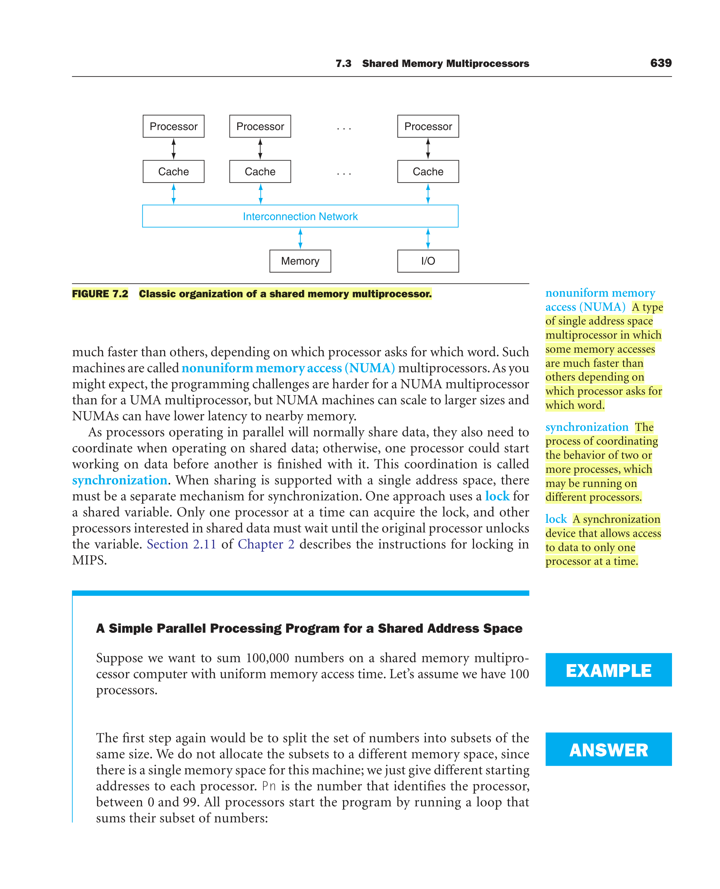
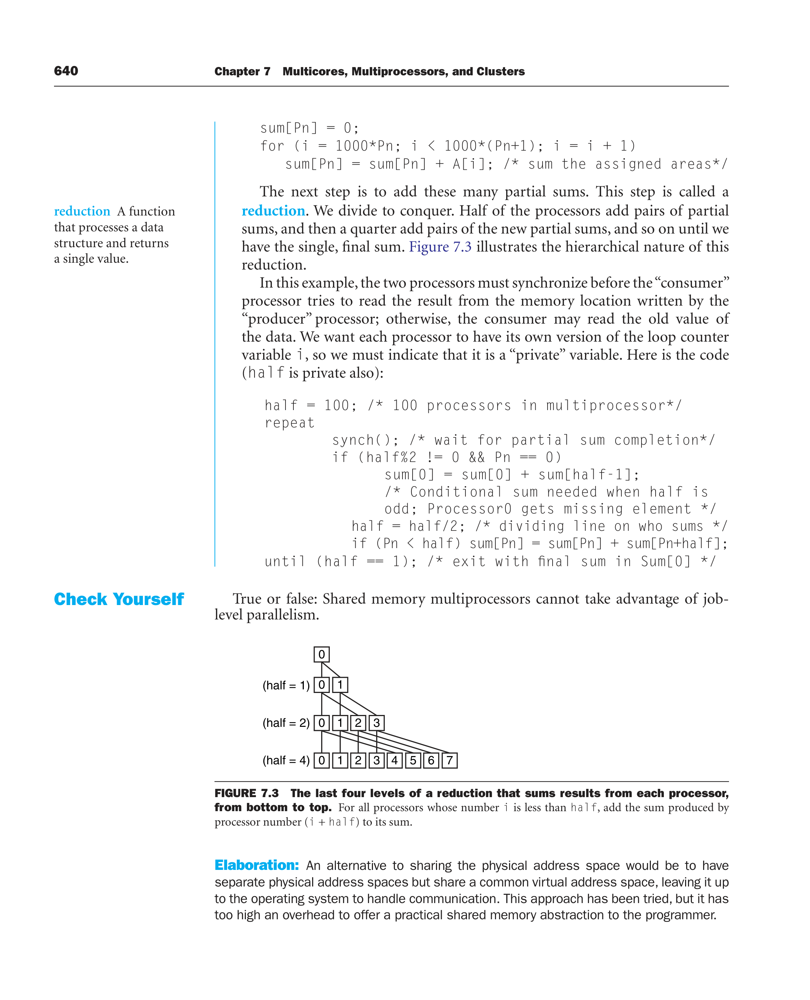
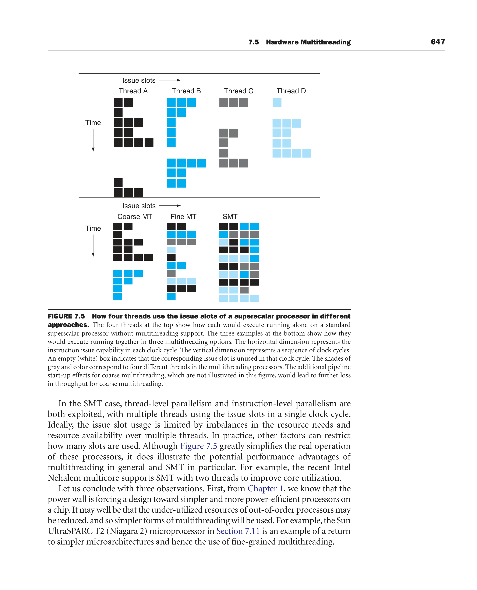
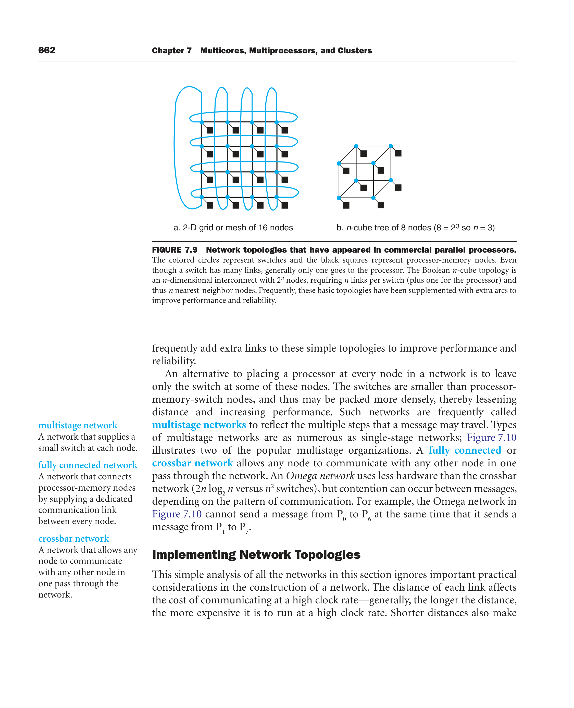
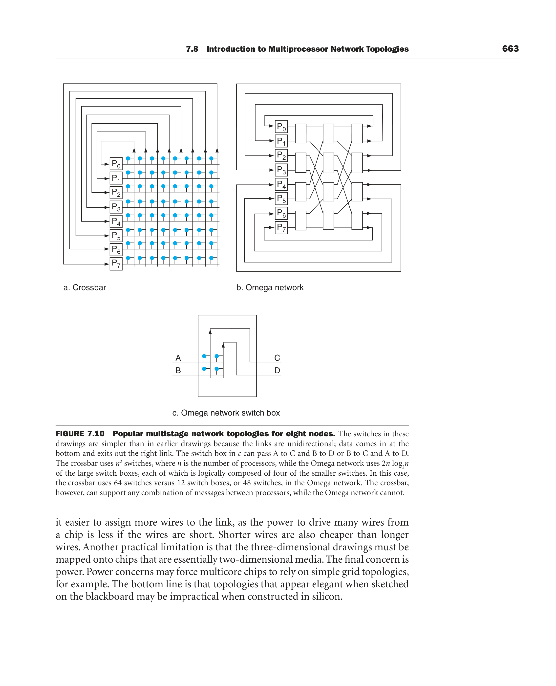
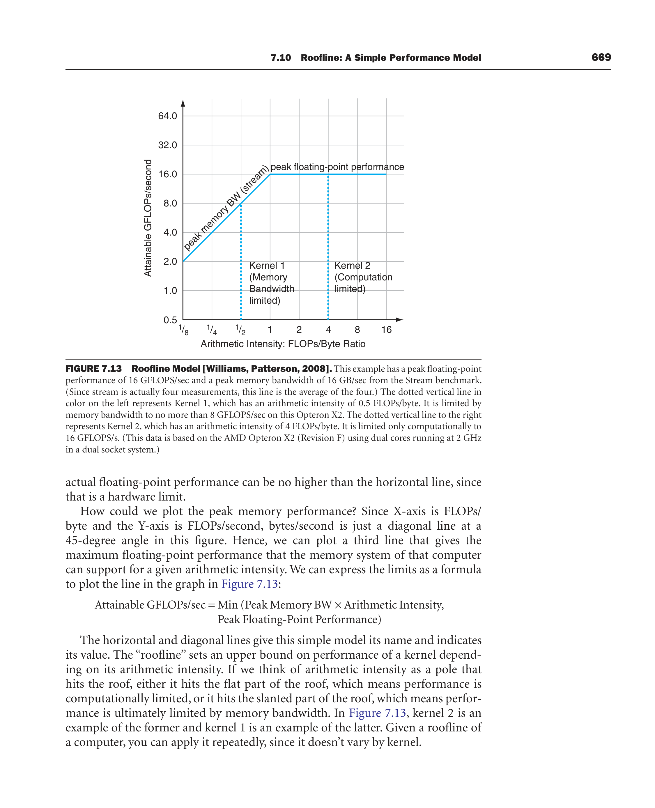

# Ch 7: Multicores, Multiprocessors, and Clusters (QUIZ, whole chapter)

P&H 4e, book pp. 632–687. 🎯 = past paper / textbook example. ⚠️ = small print.
Quizzes reward **exact terms + one-line definitions + the textbook's numbers**. Bold = memorise.

---

## 7.1 Introduction

| Term | Definition |
|---|---|
| **Multiprocessor** | a computer system with **at least two processors** (vs **uniprocessor**) |
| **Job-level / process-level parallelism** | running **independent programs** simultaneously on multiple processors (high throughput) |
| **Parallel processing program** | a **single program** that runs on multiple processors simultaneously |
| **Cluster** | a set of computers connected over a **LAN** that functions as a single large multiprocessor |
| **Multicore microprocessor** | a microprocessor containing multiple processors (**"cores"**) in a single integrated circuit |

Why multiprocessors:
- **Power** is the overriding issue. Many small efficient processors give better **performance per watt / per joule**.
- **Scalable performance**: buy as many processors as you can afford.
- **Availability** ⚠️: if one of n processors fails, the system continues with **n − 1**.
- ⚠️ The power wall means future performance comes from **more processors per chip**, not higher clock rate or better CPI. "Multicore" rather than "multiprocessor microprocessor" was chosen **to avoid redundancy in naming**. **Cores per chip expected to double every two years.** "Sequential programs mean slow programs."

### Fig 7.1: hardware vs software ⚠️
| | **Sequential** software | **Concurrent** software |
|---|---|---|
| **Serial** hardware | MATLAB matrix multiply on Pentium 4 | Windows Vista on Pentium 4 |
| **Parallel** hardware | MATLAB matrix multiply on Xeon e5345 (Clovertown) | Windows Vista on Xeon e5345 |
- Software is **sequential or concurrent**. Hardware is **serial or parallel**. Any combination is possible.
- Compilers are thought of as **sequential** (lex → parse → codegen → optimise). OSes as **concurrent** (cooperating processes).
- "Parallel processing program" = sequential **or** concurrent software running on parallel hardware.
- ⚠️ **Check Yourself 7.1**: "To benefit from a multiprocessor, an application must be concurrent" → **FALSE**. Job-level parallelism helps sequential apps, and sequential apps can be made to run on parallel hardware (it's just harder).

---

## 7.2 The difficulty of creating parallel processing programs 🎯

**The difficulty is not the hardware.** Too few important programs have been rewritten to finish one task sooner on multiprocessors.

Why it's hard:
1. You must get **better performance and efficiency** than a sequential program on a uniprocessor, otherwise why bother? Meanwhile uniprocessor tricks (**superscalar, out-of-order** = ILP) sped up sequential programs **without programmer involvement**, which reduced the pressure to rewrite.
2. **Eight reporters writing one story** analogy. The challenges are **scheduling, load balancing, time for synchronization, and overhead for communication** between the parties. It gets worse with more reporters/processors.
3. **Amdahl's law**: even small sequential parts limit speed-up.

### Amdahl for parallelism
```
Speed-up = 1 / [ (1 − F) + F/P ]       F = fraction parallelised, P = processors
Exec time after = (affected time / improvement) + unaffected time
```

🎯 **Speed-up challenge.** Want speed-up **90 with 100 processors**. How much can be sequential?
90 = 1 / [(1 − F) + F/100] → F = 89/89.1 = **0.999** → sequential can be only **0.1%**.

🎯 **Bigger problem.** Sum of **10 scalars** (sequential) + sum of two **10×10 matrices** (100 parallel adds), time per add = t.
| | 1 proc | 10 procs | 100 procs |
|---|---|---|---|
| 10×10 | 110t | 100t/10 + 10t = **20t → 5.5×** (55% of potential) | 100t/100 + 10t = **11t → 10×** (10% of potential) |
| 100×100 | 10,010t | 10,000t/10 + 10t = **1010t → 9.9×** (99%) | 10,000t/100 + 10t = **110t → 91×** (>90%) |

**Lesson: good speed-up is easier when the problem gets bigger** than with a fixed problem size.

**Strong vs weak scaling** 🎯⚠️:
- **Strong scaling** = speed-up measured while keeping the **problem size fixed**. Memory per processor ≈ **M/P**.
- **Weak scaling** = problem size grows **proportionally to the number of processors**. Memory per processor ≈ **M**.
- Example for weak scaling: the **TPC-C** debit-credit benchmark scales the number of customer accounts. A bank getting a faster computer doesn't make its customers use ATMs 100× a day.

🎯 **Balancing load.** 100×100 problem, 100 processors. Perfect balance gives 91×. If one processor does:
- **2%** of the parallel load (200 adds): time = max(9800t/99, 200t/1) + 10t = **210t → 48×** (about half!)
- **5%** (500 adds): max(9500t/99, 500t) + 10t = **510t → 20×**
Twice the load on one processor halves the speed-up. 5× the load cuts it ~5×.

⚠️ **Check Yourself 7.2**: "Strong scaling is not bound by Amdahl's law" → **FALSE**. (Answer key: weak scaling can compensate for a serial portion that would otherwise limit scalability.)

---

## 7.3 Shared memory multiprocessors (SMP) 🎯

**SMP** = offers the programmer a **single physical address space across all processors** (a more accurate name: *shared-address* multiprocessor). Communication is **implicit, via loads and stores** to shared variables.
- ⚠️ SMPs can still run independent jobs in **their own virtual address spaces**, even though they share a physical address space.
- Multicore chips usually have a common physical address space, and the hardware provides **cache coherence** (Section 5.8).

| **UMA** (uniform memory access) | **NUMA** (nonuniform memory access) |
|---|---|
| main memory takes **about the same time** no matter which processor asks or which word | some accesses are **much faster** than others depending on which processor asks for which word |
| easier to program | **harder to program**, but **scales to larger sizes** and has **lower latency to nearby memory** |

- **Synchronization**: coordinating two or more processes (possibly on different processors) so one doesn't use data before another finishes with it.
- **Lock**: a synchronization device that allows access to data to **only one processor at a time**. Others wait until it is unlocked (MIPS lock instructions are in Section 2.11).



🎯 **Example: sum 100,000 numbers on a 100-processor UMA SMP.**
1. Each processor sums its 1000 numbers: `for (i = 1000*Pn; i < 1000*(Pn+1); i++) sum[Pn] += A[i];` (no data movement, just different start addresses)
2. **Reduction** (divide and conquer): half the processors add pairs of partial sums, then a quarter, … until one sum remains (Fig 7.3).
   ```
   half = 100;
   repeat
     synch();                                  // wait for partial sums (barrier)
     if (half%2 != 0 && Pn == 0)
        sum[0] = sum[0] + sum[half-1];         // odd half: P0 picks up the extra
     half = half/2;
     if (Pn < half) sum[Pn] = sum[Pn] + sum[Pn+half];
   until (half == 1);                          // final sum in sum[0]
   ```
- ⚠️ Must **synchronize** so the "consumer" doesn't read before the "producer" has written. `i` and `half` must be **private** variables.
- **Reduction** = a function that processes a data structure and returns a **single value**.
- ⚠️ Elaboration: separate physical address spaces sharing a common *virtual* address space (OS handles communication) has been tried, but the overhead is **too high**.
- ⚠️ **Check Yourself 7.3**: "SMPs cannot take advantage of job-level parallelism" → **FALSE** (multiple jobs in their own virtual spaces run fine).



---

## 7.4 Clusters and other message-passing multiprocessors 🎯

Each processor has its **own private physical address space**. Communication is by **explicit message passing** (**send message routine** / **receive message routine**).
- Coordination is **built in**: the sender knows when it sent, the receiver knows when it arrived. An acknowledgement can be sent back.
- ⚠️ Fig 7.4: the interconnection network is between **processor-memory nodes**, not between caches and memory (unlike the SMP).
- Job-level parallelism and low-communication apps (**web search, mail servers, file servers**) run fine without shared addressing.
- Custom high-performance message-passing networks were **much more expensive** → **clusters** (commodity computers + **standard network switches over the I/O interconnect**, each running a **distinct copy of the OS**) became the most widespread message-passing machine. Virtually every Internet service runs on clusters.

**Cluster drawbacks** ⚠️:
1. **Administration cost** of n machines ≈ n independent machines (an SMP ≈ one machine). **Virtual machines** help (stop/start atomically, migrate programs off failing hardware).
2. Connected via the **I/O interconnect** (cores in a multiprocessor use the **memory interconnect**: higher bandwidth, lower latency).
3. **Division of memory**: n machines → n memories and **n copies of the OS**.

🎯 **Memory efficiency example.** Shared-memory machine with 20 GB, vs 5 clustered computers × 4 GB, OS = 1 GB each.
(20 − 1) / (5 × (4 − 1)) = 19/15 ≈ **1.25** → shared memory has **~25% more** user space.

🎯 **Sum 100,000 numbers on 100-processor message passing**: (1) **distribute** 1000 numbers to each node's local memory. (2) Each sums locally. (3) **Reduction by sending**: half the processors send to the other half, and so on.
```
limit = 100; half = 100;
repeat
  half = (half+1)/2;                          // send vs receive dividing line
  if (Pn >= half && Pn < limit) send(Pn - half, sum);
  if (Pn < (limit/2)) sum = sum + receive();
  limit = half;                               // upper limit of senders
until (half == 1);
```
⚠️ **Send/receive act as synchronization primitives too** (a receiver stalls until its message arrives). With an odd number of nodes, the **middle node sits out** that round. Elaboration: message passing is really **much slower** than an add, so it's better to have fewer nodes receive many sums.

**Message passing vs shared memory, for programmers** ⚠️:
- Message passing: **much easier for hardware designers** (no cache coherence). **Communication is explicit**, so there are **fewer performance surprises**. But it's **harder to port** sequential programs: every communication must be identified in advance.
- Cache-coherent shared memory: the hardware figures out what to communicate, so **porting is easier**.

**Cluster strengths** ⚠️: **availability** (replace a machine without bringing the system down, which is hard in an SMP), **easy expansion**, **lower cost**, **power efficiency**, rapid incremental expandability → why eBay, Google, Microsoft, Yahoo use them.

⚠️ **Grid computing**: computers spread over large areas, communicating over long-haul networks. **SETI@home**: >**5 million** users in >**200 countries**, >**19 billion** CPU hours, **257 TeraFLOPS** by end of 2006.

⚠️ **Check Yourself 7.4**:
1. "Like SMPs, message-passing computers rely on locks for synchronization" → **FALSE** (send/receive is an implicit synchronization).
2. "Unlike SMPs, message-passing computers need multiple copies of the parallel processing program and the OS" → **TRUE**.

---

## 7.5 Hardware multithreading 🎯🎯

**Hardware multithreading** = multiple threads share the functional units of **one processor** in an overlapping fashion, to **increase utilization** by switching to another thread when one stalls.
- The processor must **duplicate each thread's independent state**: **a separate register file and PC per thread**. Memory is shared via **virtual memory**.
- A **thread switch must be much faster than a process switch** (process switch = hundreds to thousands of cycles; thread switch can be **instantaneous**).

| | **Fine-grained** | **Coarse-grained** | **SMT (simultaneous)** |
|---|---|---|---|
| Switches | **every instruction / every clock**, round-robin, **skipping stalled threads** | only on **costly stalls** (e.g. **L2 cache misses**) | doesn't "switch": **issues from multiple threads in the same cycle** |
| Hides | **both short and long stalls** | only **long** stalls | fills unused issue slots with other threads' instructions |
| Main downside | **slows down individual threads** (a ready thread waits behind others) | **pipeline start-up cost**: the pipeline must be emptied/frozen and refilled after a switch → poor for short stalls | needs a **multiple-issue, dynamically scheduled** processor (register renaming + dynamic scheduling) |
| Requirement | switching must be essentially free each cycle | switching can be slower | uses existing OoO machinery |
| Example | **Sun UltraSPARC T2 (Niagara 2)**: 8 threads/core | — | **Intel Nehalem**: 2 threads/core |

- **SMT key insight**: multiple-issue processors have **more functional-unit parallelism than one thread can use**. Register renaming + dynamic scheduling let instructions from independent threads issue **without regard to dependences between them**. SMT exploits **thread-level and instruction-level parallelism at the same time**.

### Fig 7.5: issue slots 🎯 (draw this if asked "explain with a diagram")
```
 Issue slots →          (4 threads A,B,C,D, 4-wide superscalar; . = empty slot)
 Superscalar, no MT:  only thread A, many fully-empty cycles on stalls
   A A . .
   A . . .
   . . . .   <- long stall: whole processor idle
   A A A .

 Coarse MT:           Fine MT:              SMT:
   A A . .              A A . .               A A B C
   A . . .              B B B .               B C C D
   B B B .  <- switch   C . . .               A D D B
   B B . .   on stall   D D . .               C C A A
 (fewer idle cycles,  (no fully-empty rows,  (slots in one cycle shared by
  but start-up cost)   but 1 thread/cycle     many threads → fewest empties)
                       → empties within row)
```
- Superscalar without MT: limited by **lack of ILP**. A major stall (I-cache miss) leaves the **whole processor idle**.
- Coarse MT: long stalls partly hidden. **Start-up overhead** still causes idle cycles; ILP limits leave slots unused.
- Fine MT: interleaving **mostly eliminates fully empty cycles**, but only one thread issues per cycle, so **slots within a cycle** are still idle.
- SMT: TLP + ILP both exploited. **Multiple threads use the issue slots in a single cycle.**



**Three observations** ⚠️:
1. The **power wall** pushes towards simpler cores → simpler multithreading (T2 returns to **fine-grained**).
2. The key challenge is **tolerating cache-miss latency**. Fine-grained switching on a miss (T2) is probably **more effective at hiding memory latency** than SMT filling issue slots.
3. Multithreading **shares components** between tasks, and multicore shares too (FP unit, L3). That sharing reduces some of multithreading's benefit compared with more non-MT cores.

⚠️ **Check Yourself 7.5**: (1) "Both multithreading and multicore rely on parallelism to get more efficiency from a chip" → **TRUE**. (2) "SMT uses threads to improve resource utilization of a dynamically scheduled, out-of-order processor" → **TRUE**.

🎯 Past-paper style "multi-threading vs hyper-threading": **Hyper-Threading** is **Intel's brand name for SMT**. Multithreading is the general idea (fine/coarse/SMT).

---

## 7.6 SISD, MIMD, SIMD, SPMD, and Vector 🎯🎯 (Flynn's taxonomy, 1960s)

Classified by the number of **instruction streams** × **data streams**:

| | Single data | Multiple data |
|---|---|---|
| **Single instruction** | **SISD**: uniprocessor. *Example: Intel Pentium 4* | **SIMD**: *Example: SSE instructions of x86* |
| **Multiple instruction** | **MISD**: ⚠️ **no examples today** | **MIMD**: multiprocessor. *Example: Intel Xeon e5345 (Clovertown)* |

- **SPMD** (single program, multiple data) = the **normal way to program an MIMD**: one program runs on all processors, using **conditional statements** when processors should run different code. Not a hardware class.
- 🎯 **"Which Flynn category is a GPU?"** The whole GeForce 8800 (16 multiprocessors) is **MIMD**. Each Tesla multiprocessor runs **SIMT** (single instruction, multiple thread), i.e. SIMD-like execution of a warp. The answer to write: *"MIMD of multithreaded SIMD processors; NVIDIA calls the execution style SIMT."* The common short answer is **SIMD** (data parallel).

### SIMD 🎯🎯 (TT2-2026: "what is SIMD, why do GPUs / AI coprocessors use it?")
- **Definition**: the **same instruction is applied to many data streams**, e.g. one SIMD instruction adds **64 numbers** by sending 64 data streams to **64 ALUs** to form 64 sums **in one clock cycle**.
- **Virtues**:
  - All execution units are **synchronized** and respond to **one instruction from one PC**. From the programmer's view it's close to SISD.
  - Each unit has **its own address registers**, so each can use **different data addresses**.
  - **Original motivation: amortize the cost of the control unit over dozens of execution units.**
  - **Smaller program memory**: one copy of the code (message-passing MIMD needs a copy per processor; shared-memory MIMD needs multiple I-caches).
- **Works best for arrays in for loops** → needs lots of identically structured data = **data-level parallelism (DLP)**.
- ⚠️ **Weakest at case/switch statements**: units with the "wrong" data are disabled, so it runs at **1/n performance** for n cases.
- **Why GPUs / AI accelerators use SIMD** (put it together for a 5-mark answer):
  1. The workload is **massively data-parallel**: millions of pixels/vertices (or matrix/tensor elements in AI), the **same operation on each independent element**.
  2. One instruction fetch/decode drives many ALUs → **control cost amortized** → more of the chip budget and power goes to ALUs → **high throughput per watt** (power is THE constraint).
  3. **Less instruction bandwidth** and smaller code, with hazard checks once per instruction rather than per element.
  4. **Regular memory access patterns** can be coalesced into wide transfers (GPUs merge the requests from a warp).
  5. Branchy code is SIMD's weakness, but graphics/AI kernels have little divergence.

### SIMD in x86: multimedia extensions (MMX, SSE)
- Partition a wide ALU: one 64-bit ALU = **two 32-bit** = **four 16-bit** = **eight 8-bit** ALUs. Loads/stores are as wide as the widest ALU.
- Inspired by **narrow integer data**. **SSE2** = simultaneous execution of a pair of **64-bit FP** numbers.
- ⚠️ The **width is encoded in the opcode**, so the number of opcodes **exploded**: hundreds of SSE instructions.

### Vector architecture (closely identified with **Cray**)
- An older, **more elegant** interpretation of SIMD. Instead of 64 ALUs, **pipeline** one ALU (lower cost).
- Philosophy: collect data elements from memory, put them **in order into a large set of registers**, operate **sequentially in registers**, write the results back.
- Key feature: **vector registers**, e.g. **32 vector registers, each with 64 64-bit elements**.

🎯 **DAXPY (Y = a×X + Y, 64 elements)** = the inner loop of the **Linpack** benchmark ("double precision a × X plus Y").
- MIPS: a loop of 9 instructions × 64 ≈ **almost 600 instructions** executed. Vector MIPS: **6 instructions** (`l.d, lv, mulvs.d, lv, addv.d, sv`).
- Why: each vector op does 64 elements, **and** the loop overhead (nearly half the MIPS loop) is gone. Fewer instructions also **saves power**.
- Hazards: MIPS stalls on every add.d (waits for mul.d) and every s.d. Vector stalls **only for the first element** of each vector op → **~64× fewer stalls**. Loop unrolling helps MIPS stalls, but **not instruction bandwidth**.
- ⚠️ **Strip mining** = handling loops longer than the vector length (iterate full-length ops + leftovers). Shorter loops use a **vector-length register**.

**Vector vs scalar advantages** ⚠️ (7 bullets, any 4 earn marks):
1. One vector instruction = an **entire loop** → much less **instruction fetch/decode bandwidth**.
2. The compiler/programmer asserts the elements are **independent** → **no data-hazard checks within** a vector instruction.
3. **Easier than MIMD** to write efficient data-parallel code.
4. Hazard checks between vector instructions **once per vector operand**, not per element → saves power.
5. **Known memory access pattern** → heavily interleaved banks work well. Memory latency is paid **once per vector**, not once per word.
6. **No control hazards** from the loop branch (the loop is gone).
7. Savings in instruction bandwidth + hazard checks + memory bandwidth → **power/energy advantage**.

**Vector vs multimedia extensions** ⚠️:
- MMX/SSE specify **a few** operations; vector specifies **dozens**.
- Vector: the element count is in a **separate register, not the opcode** → different implementations keep **binary compatibility**. x86 adds a **new large set of opcodes** each time the "vector" length changes.
- Vector supports **strided** (every nth element) and **indexed** (addresses in a vector register) accesses. Multimedia extensions need **contiguous** data.
- Both handle flexible data widths (32×64-bit, 64×32-bit, 128×16-bit, 256×8-bit).
- Vector is a **better match to compiler technology** and **easier to evolve**.
- ⚠️ **Check Yourself 7.6**: "multimedia extensions can be thought of as a vector architecture with short vectors that supports only sequential vector data transfers" → **TRUE**.
- ⚠️ Why aren't vectors more popular? A **larger register state** increases **context switch time**, and **page faults in vector loads/stores** are hard to handle. SIMD extensions got some of the benefits. Intel's **AVX ("AVI" in the book), 2010**: SSE registers from **128 → 256 bits**, eventually **1024**. **Larrabee** GPU rumoured to have vector instructions.
- Easy to **extend a scalar ISA** with vector/multimedia instructions.

---

## 7.7 Introduction to GPUs 🎯

**How GPUs differ from CPUs** (key characteristics):
1. **Accelerators that supplement a CPU**, so they don't need to do every task. CPU + GPU = **heterogeneous multiprocessing** (another example: **IBM Cell**).
2. Programmed through **high-level APIs** (**OpenGL, DirectX**) + shading languages (**NVIDIA Cg, Microsoft HLSL**). Compilers target **intermediate languages**, and the **driver** generates GPU machine code. **No backward binary compatibility** to maintain → **faster innovation** than CPUs.
3. Graphics = drawing **vertices** of 3D primitives (lines, triangles) and **shading/rendering pixel fragments**. Games draw **20–30× as many pixels as vertices**.
4. Each vertex/pixel can be processed **independently** → many threads of vertex and pixel shader programs in parallel.
5. Data types: vertex = **(x, y, z, w)**, each a **32-bit float**. Pixel = **(R, G, B, alpha)**, originally 8-bit unsigned ints, now single-precision floats in 0.0–1.0.
6. Working set of **hundreds of MB**, **without** the temporal locality of mainstream apps, and lots of **data-level parallelism**.

**Resulting architecture differences** ⚠️🎯:
- **Biggest difference: GPUs do NOT rely on multilevel caches** to hide memory latency. They use **enough threads to hide the latency**: between a request and the data arriving, they run hundreds or thousands of other threads.
- **Extensive parallelism**: many processors, many threads. **Each GPU processor is highly multithreaded.**
- Memory is oriented to **bandwidth, not latency**. Separate graphics DRAM chips that are **wider with higher bandwidth**. Smaller memories: in 2008 a GPU had **≤ 1 GB**, a CPU **2–32 GB**. ⚠️ Remember the **time to transfer data CPU ↔ GPU memory** (the GPU is a coprocessor).
- Historically **heterogeneous special-purpose** processors. Now trending to **identical general-purpose** ones.
- Historically **SIMD** instructions (4-element data). Recent GPUs focus more on **scalar** instructions for programmability.
- ⚠️ **No double precision** until **2008**. Even then SP is **8–10× faster** than DP.
- ⚠️ **Check Yourself 7.7**: "GPUs rely on graphics DRAM chips to **reduce memory latency**" → **FALSE**. Graphics DRAMs are prized for **higher bandwidth**.

**GPGPU** = general-purpose use of GPUs. **Brook** = a streaming language. **CUDA** (Compute Unified Device Architecture, NVIDIA) = write **C programs** for the GPU (with restrictions).

### NVIDIA Tesla architecture ⚠️ (numbers)
- **Discrete GPU** on a separate card over **PCI-Express**. **Motherboard GPUs** are integrated into the north/south bridge chip set.
- Tesla chips have **1–16 nodes**, which NVIDIA calls **multiprocessors**. **GeForce 8800 GTX**: **16 multiprocessors**, **1.35 GHz**. Each multiprocessor has **8 streaming processors** (multithreaded SP floating-point and integer units).
- 🎯 Peak = 16 MPs × 8 SPs × 2 FLOPs/instr (**multiply-add**) × 1 instr/clock × 1.35 GHz = **345.6 GFLOPs/s**.
- Each multiprocessor: **16 KB** software-managed local store + **8192 32-bit registers**.
- Memory: **6 partitions** of 900 MHz **GDDR3**, each **8 bytes wide**, 128 MB → **768 MB** total. Bandwidth = 6 × 8 B × 2 transfers/clock × 0.9 GHz = **86.4 GB/s**.
- **Warp = a group of 32 threads**, the **unit of scheduling**. Active threads in a warp execute in parallel in **SIMD fashion**.
- **Divergence**: if threads of a warp take different branch paths, the warp executes **both paths sequentially** with some threads inactive, then rejoins. All 32 threads should run together for best performance. The hardware also **merges address streams** into fewer, larger memory transfers.
- **SIMT (single-instruction multiple-thread)**: dynamically discovers which threads of a warp can execute the same instruction together.
- Tesla MP schedules **24 warps** with **fine-grained multithreading**, switching every **2 or 4 clocks** (minimum 2) across 8 SPs. **UltraSPARC T2**: one processor, **8 threads**, switches **every clock**. T2 multithreads **over time**; Tesla over **time and space**.
- **CUDA terms**: a CUDA program = a unified C/C++ program for a heterogeneous CPU + GPU system, running on the CPU and dispatching work to the GPU. **Thread** = a piece of the program for the GPU. **Thread block** = up to **512 threads**, all scheduled on the **same multiprocessor**, sharing local memory (communicate by loads/stores). Registers per thread × threads per block ≤ **8192**. Warps of 32 are packed from thread blocks. Blocks/warps with < 32 threads are less efficient.
- ⚠️ If all 32 threads of a warp ran independent instructions, each would run at **1/16th the peak** of a full warp.
- Programmers can think of Tesla as **MIMD** (each thread has an effective PC), but should write control flow that lets SIMT run in SIMD fashion.

### Fig 7.8: static vs dynamic × ILP vs DLP 🎯⚠️
| | **Static** (discovered at compile time) | **Dynamic** (discovered at runtime) |
|---|---|---|
| **ILP** | **VLIW** | **Superscalar** |
| **DLP** | **SIMD or Vector** | **Tesla multiprocessor** |
Vector relies on a **vectorizing compiler**. Tesla **discovers DLP among threads at runtime**, so it needs no vectorizing compiler.

---

## 7.8 Multiprocessor network topologies 🎯

**Network costs**: number of switches, number of links per switch, width (bits) per link, link length on chip.
**Network performance**: unloaded **latency**, **throughput** (max messages per time), **contention delays**, variable performance by communication pattern. Also **fault tolerance** and **power efficiency**.
Drawings: **black square = processor-memory node**, **coloured circle = switch**. Links are **bidirectional**.

- **Bus** → **Ring** (the first improvement over a bus; nodes in sequence, messages **hop** through intermediate nodes; **many simultaneous transfers** unlike a bus).
- **Total network bandwidth** = bandwidth per link × number of links (**best case**).
- **Bisection bandwidth** = split the machine into two halves and sum the bandwidth of the links crossing the line (**worst case**). For asymmetric topologies take the **most pessimistic** split: "parallel programs are limited by the weakest link".

| Topology (P nodes) | Total network BW (in link units) | Bisection BW |
|---|---|---|
| **Bus** | 1 (just the bus) | **1** |
| **Ring** | **P** | **2** |
| **Fully connected** | **P(P − 1)/2** | **(P/2)²** |

⚠️ "If a link is as fast as the bus, a ring is only **2×** faster than a bus in the **worst** case but **P×** faster in the **best** case."

- Commercial topologies (Fig 7.9): **2-D grid/mesh** (16 nodes) and **n-cube** (hypercube): **2ⁿ nodes**, **n links per switch** (+1 to the processor), **n nearest neighbours**. Real machines add extra links for performance/reliability.
- **Multistage networks**: switches at some nodes without processors (smaller, denser).
  - **Crossbar**: any node to any other in **one pass**, **n² switches**, supports **any** combination of messages.
  - **Omega**: **2n log₂n switches**, less hardware, but **contention** can occur. ⚠️ 8 nodes: crossbar **64** switches vs Omega **12 switch boxes = 48 switches**. Omega **cannot** send P0→P6 at the same time as P1→P7.
- Practical issues: longer links are expensive at high clock rates. Short wires allow more wires per link and less power. 3D drawings must map onto **2D chips**. **Power may force simple grid topologies.** "Elegant on the blackboard may be impractical in silicon."




---

## 7.9 Multiprocessor benchmarks ⚠️

Rule: **you can't change the benchmark** (fixed source and data, one right answer). A common exception: **allow weak scaling** (bigger problem for more processors).

| Benchmark | Scaling | Reprogram? | Notes |
|---|---|---|---|
| **Linpack** | Weak | **Yes** (any form, any language) | dense linear algebra, **Gaussian elimination**. **DAXPY** = most of its time. **Top500** list twice a year; #1 = "world's fastest computer" |
| **SPECrate** | Weak | No | runs **many copies** of SPEC CPU simultaneously → **job-level parallelism**, no communication |
| **SPLASH / SPLASH-2** (Stanford) | **Strong** (two problem sizes) | No | kernels + apps (FFT, LU, Cholesky, Radix sort, Barnes-Hut, Ocean, Ray tracer, …) |
| **NAS** (NASA) | Weak | Yes (**C or Fortran only**) | CFD, **5 kernels** (EP embarrassingly parallel, MG, CG, FT, IS) |
| **PARSEC** (Princeton) | Weak | No | multithreaded with **Pthreads** and **OpenMP**. **9 applications + 3 kernels**. 8 data-parallel, 3 pipelined, 1 unstructured |
| **Berkeley Design Patterns** | Strong or weak | Yes | **13 patterns** (FSM, combinational logic, graph traversal, structured grid, dense matrix, sparse matrix, spectral/FFT, dynamic programming, N-body, MapReduce, backtrack/branch-and-bound, graphical models, unstructured grid) |

- **Pthreads** = UNIX API for creating/manipulating threads. **OpenMP** = API for shared-memory multiprocessing in C/C++/Fortran (compiler directives + library + runtime).
- Downside of traditional rules: **innovation is limited to architecture and compiler**. Better algorithms, data structures and languages can't be used. Berkeley's approach keeps definitions high-level so **any** level can innovate.
- ⚠️ **Check Yourself 7.9**: "The main drawback of conventional parallel benchmarks is that the rules that ensure fairness also suppress innovation" → **TRUE**.

---

## 7.10 Roofline: a simple performance model 🎯

- Analogy to the **3Cs model** (imperfect but insightful).
- **Arithmetic intensity** = **floating-point operations / bytes of data accessed from main memory** (FLOPs/byte).
- Some kernels' intensity **scales with problem size** (Dense Matrix, N-body: O(N) / O(log N)). Others are constant (SpMV, structured grids: O(1)) → weak scaling can look better.
- Plot (log-log): x = arithmetic intensity, y = attainable GFLOPs/s. **Horizontal line = peak FP performance** (from the manual). **45° diagonal = peak memory bandwidth** (from the **Stream benchmark**).

```
Attainable GFLOPs/s = Min( Peak Memory BW × Arithmetic Intensity,  Peak FP Performance )
```
- If the kernel's pole hits the **flat roof** → **computation limited**. The **slanted roof** → **memory-bandwidth limited**.
- 🎯 Fig 7.13 (Opteron X2): peak **16 GFLOPs/s**, memory **16 GB/s**. **Kernel 1**, AI **0.5** → 16 × 0.5 = **8 GFLOPs/s (memory-bound)**. **Kernel 2**, AI **4** → min(64, 16) = **16 GFLOPs/s (compute-bound)**.
- **Ridge point** = where the roofs meet = peak FP / peak BW. Far **right** → only high-intensity kernels reach peak. Far **left** → almost any kernel can.
- 🎯 Opteron **X2 → X4**: same socket, so the **same memory BW**. X4 has **2× cores** and **2× FP per core** (two SSE2 FP instructions per clock vs one) → >4× peak FP. **Ridge moves from 1 to 5**. Kernels need AI > 1 (or must fit in X4's new **2 MB L3**) to gain. Kernels that were compute-bound on X2 can become memory-bound on X4.
- The roofline is drawn **once per computer**, not per kernel. Works for **uniprocessors too**.



**Optimizations ("ceilings")** 🎯:
- **Computational**: (1) **Floating-point operation mix**: balance adds and multiplies (fused multiply-add or equal adders/multipliers), and keep a high FP fraction. (2) **Improve ILP and apply SIMD**: unroll loops, use SIMD for pairs of DP operands.
- **Memory**: (3) **Software prefetching**: keep many memory operations in flight. (4) **Memory affinity**: put data and the threads using it on the **same memory-processor pair** (avoid going across the chip interconnect to another chip's DRAM).
- **You can't break through a ceiling without doing its optimization.** The gap between a ceiling and the next limit = the **reward** for that optimization. Fig 7.15: optimization 2 (ILP) and optimization 4 (affinity) have big benefits on the Opteron.
- Fig 7.16 regions: right **trapezoid** → computation optimizations only (Kernel 2). Middle **parallelogram** → both (Kernel 1: start with 2 and 4). Lower-left **triangle** → memory only.
- ⚠️ Ceilings are ordered so **lower ceilings are easier** to optimize.
- ⚠️ Arithmetic intensity isn't fixed: cache optimizations (unroll + group statements with similar addresses, or a cache instruction that **allocates without filling from memory**) reduce memory traffic and **move the pole right** (by ~1.5×).
- Quirk: the roofline **assumes the program is load-balanced**. Raw DRAM bandwidth as the roof is too optimistic, which is why Stream is used (careful code may even exceed Stream).
- Other uses: L2 bandwidth as the diagonal (moves up, ridge moves left), sort (records/sec), I/O (IOPS vs instructions per I/O).

---

## 7.11 Real stuff: four multicores on the roofline ⚠️

| | Intel **Xeon e5345** (Clovertown) | AMD **Opteron X4 2356** (Barcelona) | Sun **UltraSPARC T2 5140** (Niagara 2) | **IBM Cell QS20** |
|---|---|---|---|---|
| ISA | x86/64 | x86/64 | SPARC | Cell |
| Threads / cores / sockets | 8 / 8 / 2 | 8 / 8 / 2 | **128 / 16** / 2 | 16 / 16 / 2 |
| Clock | 2.33 GHz | 2.30 GHz | **1.17 GHz** (lowest) | **3.2 GHz** (highest) |
| Peak DP GFLOPs | **75 (highest)** | 74 | 22 | 29 |
| Ridge point | high (needs AI ≥ ~8; fig: 6) | ~5 (fig: 4) | **1/3** (amazingly low) | **0.75** |
| Memory | dual **front-side buses** + separate **north bridge** chip → low BW | memory controller **on chip**, **HyperTransport** links, "glueless" | 4 memory controllers/chip, 8 simple cores, **fine-grained MT 8 threads/core** | heterogeneous: 1 PowerPC core + **8 SPEs** with **local memory (not cache)**, **DMA**. **XDR** DRAM (game consoles) |

**Kernels**: **SpMV** (sparse matrix × vector, AI **0.166 → 0.25** with register blocking) and **LBMHD** (Lattice-Boltzmann magneto-hydrodynamics, structured grid, AI **0.70 → 1.07** by not filling the cache block on a write that overwrites the whole block. All but T2 support this. Cell gets 1.07 natively via DMA).
- SpMV optimizations: prefetching, memory affinity, **compressing data structures** (16-bit indices).
- LBMHD optimizations: memory affinity, **TLB miss minimization** (structure of arrays), loop unrolling/reordering, **"SIMD-ize"** (hand-written SSE for x86).
- ⚠️ Results: **Xeon e5345 has the highest peak but the LOWEST delivered performance** (dual FSB bottleneck, worst scaling). On SpMV the **T2 beats both x86s** despite the lowest clock. **Cell is fastest on both.** On LBMHD Opteron X4 beats T2.
- **Productivity** (naïve % of optimized): **T2 easiest (86% / 93%)**: big memory BW, simple cores, just use many threads. Xeon hard (FSB behaviour, prefetching, SIMD). Opteron needed the most optimization types. **Cell: no base version** (you must rewrite for DMA/local store). But DMA works like software prefetch, and Cell reached **~90%** of the memory roofline vs ≤ 50% for the others.
- ⚠️ T2 pitfall: **64 hardware threads per chip but a 4-way set-associative L2** → conflict misses (set associativity should match the thread count).

---

## 7.12 Fallacies and pitfalls 🎯

- **Fallacy: "Amdahl's law doesn't apply to parallel computers."** In 1987 a research head claimed it was broken by linear speed-up on **1000** processors. They used **weak scaling**: 1000× more work in comparable time, with a constant sequential part. **Amdahl still applies.** Faster computers are used to run **larger problems**, but watch how the algorithm scales.
- **Fallacy: "Peak performance tracks observed performance."** Xeon e5345 had the highest peak and was the slowest. Marketers multiply an unattainable per-node peak by the processor count, assuming perfect speed-up ("multiplying the sins"). Roofline puts peak in perspective.
- **Pitfall: not developing software to take advantage of / optimize for a multiprocessor.** Example: the **SGI OS protected the page table with a single lock**. Fine on a uniprocessor, but on a multiprocessor parallel page allocation at start-up gets **serialized**, even for independent jobs! Fix: **locks on smaller portions** of the page table.

## 7.13 Concluding remarks: reasons to be hopeful ⚠️
1. **Software as a service** (software runs remotely, accessed over the Internet, charged by use) is growing, and clusters deliver it with **24×7×365** availability.
2. Scientific/engineering computing has a limitless thirst. **Clusters are >80% of the Top500** (2007 Linpack).
3. **All** desktop/server makers are building multiprocessors, so there's no easy path for sequential apps.
4. On-chip multiple processors give **much lower latency and higher bandwidth** communication.
5. Success can now be **sublinear** (the microprocessor definition: performance ∝ √area was fine) rather than requiring linear speed-up.
6. **Just-in-time runtime compilation** lets software adapt to the core count.
7. **Open source** is a meritocracy that embraces new languages and change.
Quote: Paul Otellini (Intel, 2004): "...This is not a race. This is a sea change in computing."

---

## Exam-ready short answers (write these almost verbatim)

**Q: Differentiate shared memory and message passing multiprocessors.**
SMP: single physical address space, implicit communication via loads/stores, needs locks + cache coherence, one OS copy, easier porting, harder to scale (UMA/NUMA). Message passing: private address spaces per node, explicit send/receive (which synchronize implicitly), no coherence hardware, n OS copies, scales to clusters, better availability, harder to port.

**Q: Fine vs coarse multithreading?** Fine: switch every instruction (round-robin, skip stalled threads). Hides short and long stalls. Slows individual threads. Coarse: switch only on costly stalls (L2 miss). Doesn't slow threads, but the pipeline start-up cost means it can't hide short stalls.

**Q: Why is SMT possible / what is it?** Multiple-issue OoO cores have more functional units than one thread can use. With register renaming + dynamic scheduling, instructions from several threads issue in the same cycle, exploiting TLP and ILP together (Intel Nehalem, 2 threads, "Hyper-Threading").

**Q: Strong vs weak scaling?** Strong: fixed problem size, speed-up vs P (memory per processor M/P). Weak: problem size grows with P (memory per processor M).

**Q: Four components of Flynn's taxonomy** (past paper wording): SISD (uniprocessor, Pentium 4), SIMD (one instruction, many data, x86 SSE / vector / GPUs), MISD (no examples today), MIMD (multiprocessors, Xeon e5345). Plus SPMD = how MIMDs are programmed.
