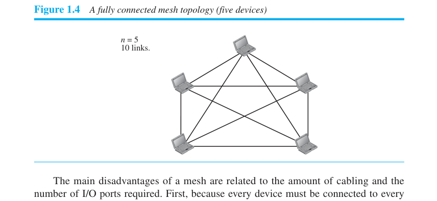
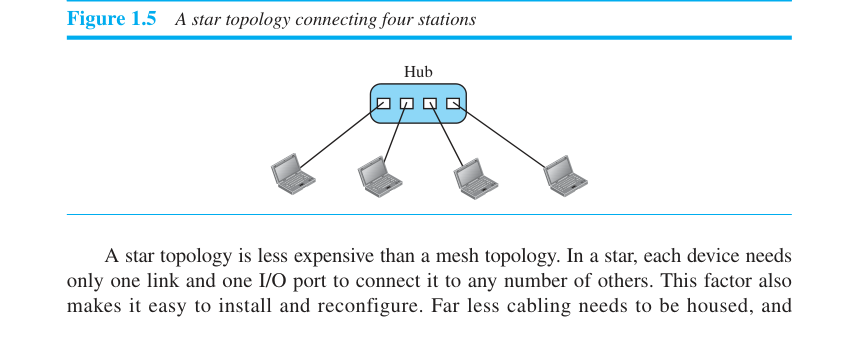
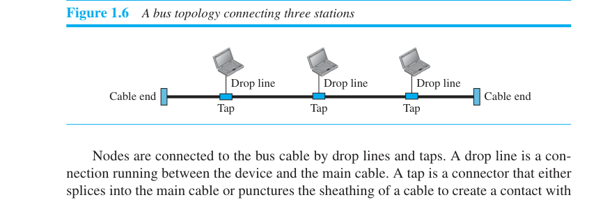
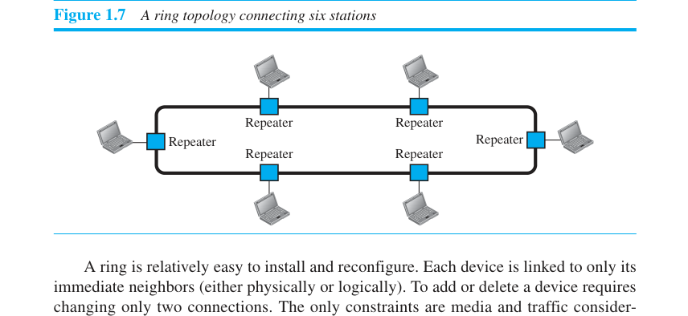
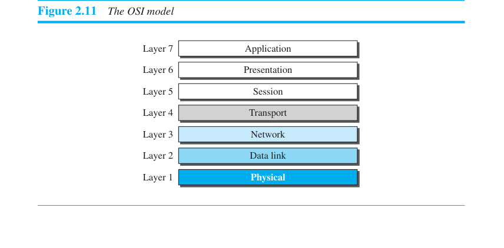
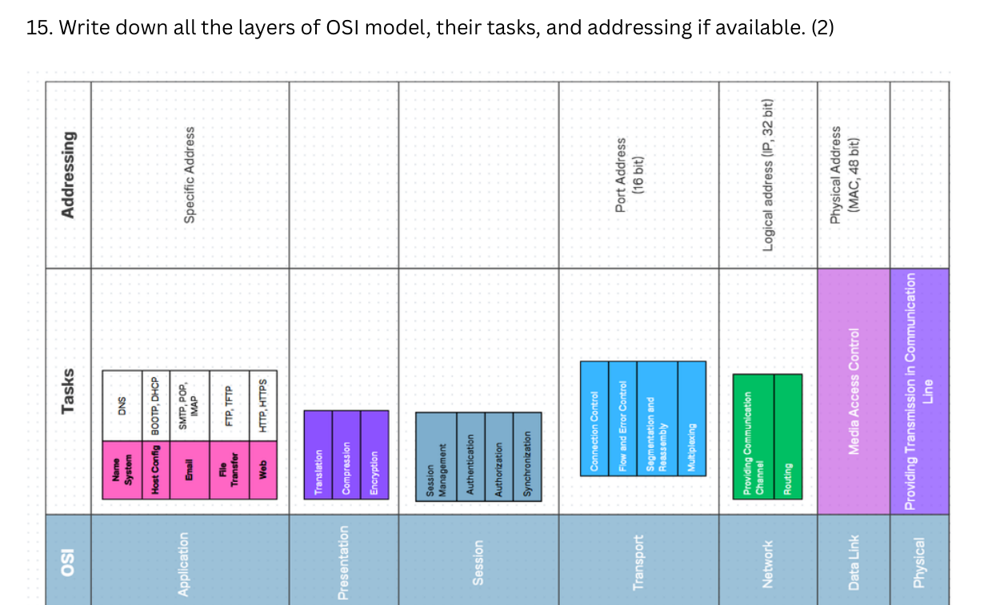
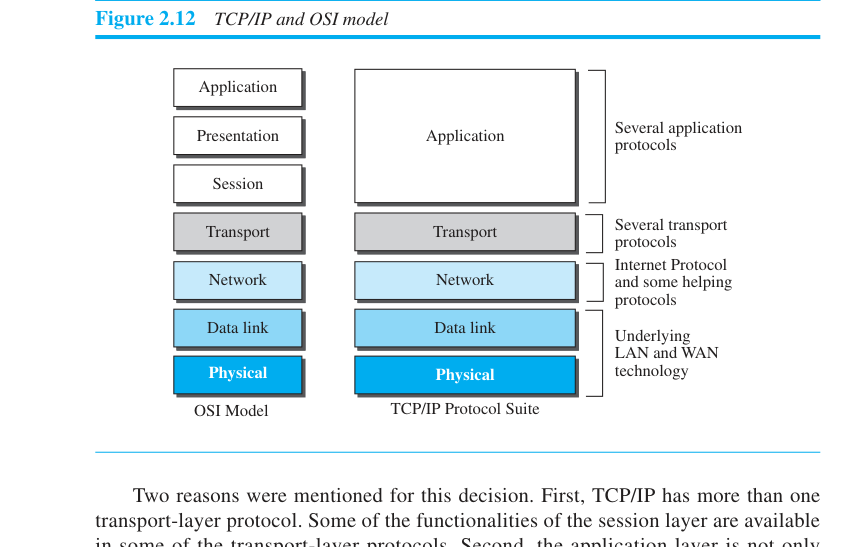
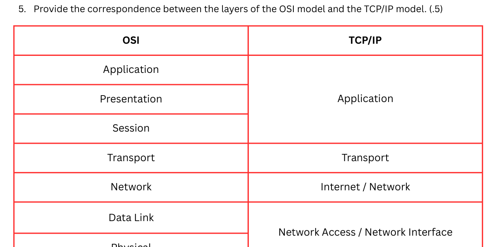
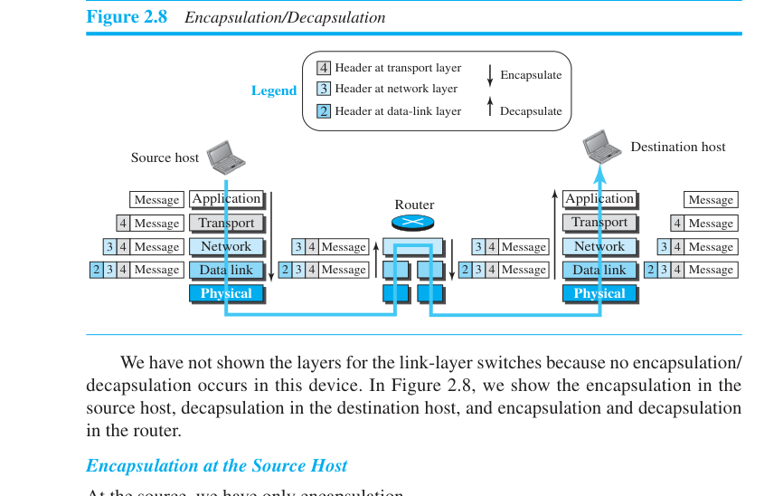

# Ch1–2 — Full coverage, not just OSI (~1 hr)

You read till the OSI model, so Ch2's second half is your freshest material. But Ch1
has real, askable content — including a small amount of MATH (mesh link counts) that
shows up in the book's own problem set. Verified against your PDF, printed pages 3–48.

Structure: Ch1 first (the stuff you probably skimmed), then Ch2 (reinforcement + the
past-paper drills). Book's own end-of-chapter questions with answers at the end of
each half — those are the closest thing to a question bank for the theory chapters.

---

# CHAPTER 1 — Introduction

## 1.1 Data communications fundamentals

**Effectiveness of a data comm system — 4 characteristics** (definition-list question):
1. **Delivery** — data reaches the correct destination, and *only* that destination.
2. **Accuracy** — data arrives unaltered; altered + uncorrected = unusable.
3. **Timeliness** — data arrives when it's still useful; for audio/video this means
   real-time transmission (same order, no significant delay).
4. **Jitter** — *variation* in packet arrival time. Packets sent every 30 ms arriving
   at 30 ms/40 ms delays = uneven video. (Jitter is about *unevenness*, not lateness.)

**Five components of a data comm system** (book Q1-1 asks this verbatim):
**Message, Sender, Receiver, Transmission medium, Protocol.**
Protocol = the set of rules governing communication — without it, two devices are
"connected but not communicating" (book's French/Japanese speakers analogy).

**Data representation** — one line each:
- **Text**: bit patterns; **Unicode (32 bits/symbol)**; ASCII = first 127 chars of
  Unicode ("Basic Latin").
- **Numbers**: converted directly to binary (NOT ASCII) — simplifies math ops.
- **Images**: matrix of **pixels**; more pixels = better resolution = more memory.
  B&W = 1 bit/pixel; 4 gray levels = 2 bits; color via **RGB** or **YCM**.
- **Audio**: continuous by nature (not discrete).
- **Video**: continuous (camera) or a sequence of discrete images conveying motion.

**Data flow — the classic trio** (with the book's exact examples):
| Mode | Direction | Example | Capacity use |
|---|---|---|---|
| Simplex | one-way only | keyboard→CPU, CPU→monitor | full capacity, one direction |
| Half-duplex | both ways, one at a time | walkie-talkie, CB radio | full capacity to whoever's sending |
| Full-duplex | both ways simultaneously | telephone | capacity shared (two paths or divided channel) |

## 1.2 Networks: criteria and physical structures

**Network criteria — 3** (book Q1-2 verbatim): **performance, reliability, security.**
- Performance: transit time, response time; measured by **throughput and delay** —
  and they *conflict*: push more data → throughput up but congestion → delay up.
  (This tension is a favorite one-line "explain why" question.)
- Reliability: frequency of failure, recovery time, robustness in catastrophe.
- Security: protection from unauthorized access/damage + recovery policies.

**Connection types:**
- **Point-to-point** — dedicated link between exactly 2 devices (TV remote → TV).
- **Multipoint (multidrop)** — >2 devices share one link; capacity shared
  **spatially** (simultaneous) or **timeshared** (take turns).

## 1.3 The four topologies — THE most examinable part of Ch1

### Mesh — every device linked to every other
```
Links needed = n(n−1)/2  (duplex links)      Ports per device = n−1
```
**This is Ch1's only formula. Drill it: n=5 → 10 links; n=6 → 15 links, 5 ports each**
(that's book problem P1-3, answered).
- ✅ Dedicated links (no traffic sharing), robust (one link dies ≠ system dies),
  privacy/security, easy fault identification & isolation.
- ❌ Cabling bulk + I/O port cost — installation/reconnection hard, expensive.
- Real use: backbone connections, telephone regional offices.



### Star — every device linked only to a central hub
- ✅ Cheap(er): 1 link + 1 port per device; easy install/reconfigure; robust (one link
  fails → only that device affected); easy fault isolation via the hub.
- ❌ **Single point of failure: hub dies → whole network dead.** More cabling than
  bus/ring (everything runs to the hub).
- Real use: modern LANs.



### Bus — one backbone cable, devices attach via drop lines + taps
- Multipoint (the other three are point-to-point based).
- ✅ Easy install, least cable (backbone + short drop lines).
- ❌ Hard to add devices/reconnect; signal weakens along the cable (taps limited);
  tap reflections degrade quality; **a backbone fault kills ALL transmission, even
  between devices on the same side** (the break reflects noise both ways).
- Real use: early Ethernet (legacy now).



### Ring — each device linked to exactly its two neighbors; signal circulates one way
- Each device contains a **repeater** that regenerates bits and passes them on.
- ✅ Easy install/reconfig (add/delete touches only 2 connections); fault isolation
  easy (no signal within a time window → device raises an alarm).
- ❌ Unidirectional traffic: **one break (or one dead station) can disable the whole
  ring** — mitigated by a dual ring or a bypass-capable switch.
- Real use: IBM Token Ring (legacy).



**Failure-consequence drill (book P1-4, 5 devices):** mesh → only that link's pair
loses their direct path, network fine; star → one device drops (unless it's the hub!);
bus → everything stops; ring → whole ring down unless dual-ring/bypass.

**Unplugging drill (P1-6/P1-7):** ring station unplugged → ring broken → network down
(simple ring). Bus station unplugged → drop line dead but backbone intact → *that
station* is off, others continue (contrast with a backbone *cut*, which kills all).

## 1.4 Network types

**LAN vs WAN — know the three axes of difference:**
| | LAN | WAN |
|---|---|---|
| Span | office / building / campus | town / country / world |
| Interconnects | **hosts** | **connecting devices** (switches, routers, modems) |
| Ownership | private (the org using it) | run by comm companies, **leased** |

- WAN flavors: **point-to-point WAN** (two ends over cable/air) vs **switched WAN**
  (several point-to-point WANs joined by switches — the global backbone).
- **internet (lowercase) = any 2+ interconnected networks. Internet (capital I) = THE
  global one.** (Book Q1-10; free mark, don't fumble the capitalization distinction.)
- Two PCs + a hub at home → still a LAN (P1-5). Size doesn't matter; ownership/span do.

## 1.5 Switching — circuit vs packet (high-yield compare/contrast)

**Circuit-switched:** a dedicated path (circuit) is set up first and stays reserved;
switches just activate/deactivate it, **no storing capability**.
- Efficient **only at full capacity** — most of the time partial use = waste.
- Example: traditional telephone network. (Q1-14: a local phone call → circuit-switched.)

**Packet-switched:** data travels as independent **packets**; routers **store and
forward** (queues!).
- More efficient (capacity shared on demand) BUT packets may queue → **delays**.
- This is computer networking's choice; bursty data was the whole motivation.

One-sentence contrast worth memorizing: *circuit switching reserves capacity whether
used or not; packet switching shares capacity on demand at the cost of queuing delay.*

## 1.6 Internet structure & access (recognition level)

- Hierarchy: **backbones** (international ISPs — Sprint/Verizon/AT&T class) connected
  at **peering points** → **provider networks** (national/regional ISPs) → **customer
  networks** (edge, pay providers for service).
- Access methods: **dial-up** (modem converts data to voice; slow; line can't carry
  voice simultaneously), **DSL** (voice + data simultaneously), **cable** (shared with
  neighbors → speed varies), **wireless WAN**, **direct connection** (big org leases
  high-speed WAN, becomes its own local ISP).

## 1.7 History + standards (skim once — 5 minutes, cheap recognition marks)

Timeline anchors: 1961 Kleinrock — packet-switching theory (MIT) → 1969 **ARPANET**,
4 nodes (UCLA, UCSB, SRI, Utah) via IMPs, NCP software → 1973 **Cerf & Kahn** paper
(gateways, encapsulation, datagrams) → TCP split into **TCP + IP** → 1983 TCP/IP
becomes ARPANET's official protocol; MILNET splits off → NSFNET (1986, T-1 backbone)
→ **WWW invented by Tim Berners-Lee at CERN** (1990s explosion).

Standards pipeline: **Internet draft** (working doc, no status, 6-month lifetime) →
published as **RFC** → maturity levels: **proposed standard → draft standard (after 2
independent interoperable implementations) → Internet standard**; side categories:
historic, experimental, informational. Requirement levels: required (IP, ICMP),
recommended (FTP, TELNET), elective, limited use, not recommended.

Administration: **ISOC** (umbrella) → **IAB** (technical advisor, RFC editorial) →
**IETF** (operational problems, near-term, working groups under IESG) vs **IRTF**
(long-term research, under IRSG). Q1-19 asks exactly the IETF/IRTF split: *operational
now vs research later.*

## Ch1 rapid-fire answers (book's own questions — cover the right column)

| Question | Answer |
|---|---|
| Q1-8: cable links for n devices, each topology | mesh n(n−1)/2 · star n · ring n · bus 1 backbone + n drop lines |
| Q1-13: point-to-point WANs to fully connect n LANs | n(n−1)/2 — same mesh formula in disguise! |
| P1-1: max symbols in Unicode | 2³² |
| P1-2: 16-bit pixels → colors | 2¹⁶ = 65,536 |
| P1-3: 6-device mesh | 15 cables, 5 ports each |
| Q1-12: does a link-layer switch need an address to relay Host1→Host3? | **No.** The frame is addressed *to Host 3*, never to the switch — the switch just reads that destination field and forwards out the right port (mail-sorter analogy: sorters route envelopes, envelopes aren't addressed to sorters). Contrast: a **router** DOES have addresses — off-network frames are sent *to the router itself* |
| P1-8: most delay-sensitive of email / file copy / web surfing | web surfing (interactive) |
| P1-9: local phone call — point-to-point or multipoint? | point-to-point (dedicated circuit for the call's duration) |

---

# CHAPTER 2 — Network Models

## 2.1 Protocol layering (the part before OSI that's easy to skip — don't)

**Why layer at all?** Divide complex tasks into smaller ones; **modularity** (a layer
is a black box — swap implementations freely if inputs/outputs match); **separate
services from implementation**; intermediate devices need only *some* layers (cheaper).
Honest disadvantage if asked: layering adds overhead/complexity vs one monolithic task.

**The two principles** (book Q2-1 / past-paper-adjacent):
1. **Bidirectionality** → each layer must perform **two opposite tasks** (talk/listen,
   encrypt/decrypt, send/receive).
2. **The objects under a given layer at both sites must be identical** (same plaintext
   under layer 3 at both ends; same ciphertext under layer 2; same mail under layer 1).

**Logical connection** = the imaginary layer-to-layer link between peer layers. Each
layer "thinks" it talks directly to its peer.

## 2.2 The 7 OSI layers — task + addressing (past paper Q15, 2 marks)

| # | Layer | Core task | Addressing | PDU name |
|---|---|---|---|---|
| 7 | Application | User-facing services (HTTP, SMTP, FTP, DNS...); process-to-process | Names (URLs, email addresses) | Message |
| 6 | Presentation | Translation, **encryption/decryption**, compression | — | Message |
| 5 | Session | Dialog establishment/maintenance/sync | — | Message |
| 4 | Transport | End-to-end delivery, **segmentation + reassembly, sequence numbers, flow control, error control** | Port numbers (**16 bit**) | Segment (TCP) / User datagram (UDP) |
| 3 | Network | Logical addressing, **routing (best path)**, host-to-host across links | Logical/IP addresses (**32 bit**) | Datagram |
| 2 | Data link | Framing, MAC addressing, hop-to-hop delivery, error detection | Physical/MAC addresses (**48 bit**) | Frame |
| 1 | Physical | Raw bit transmission (voltages, timing, connectors) | none — bits can't carry addresses | Bits |

Memory device: **A**ll **P**eople **S**eem **T**o **N**eed **D**ata **P**rocessing (7→1).



The past paper's Q15 model answer includes the **address bit-widths** (16/32/48) —
write them; it's the cheapest way to match the marking scheme. Here is that model
answer itself (this is what full marks looks like):



## 2.3 Instant answers to the "which layer does X" family (past paper Q1–Q6)

- Best path among multiple routes → **Network** (routing).
- Recovering a lost PDU → **Transport** (error control/retransmission).
- Sender too fast, receiver overwhelmed → **Transport** (flow control). Data-link also
  does hop-to-hop flow control, but end-to-end = transport — and the question said the
  receiver "can't handle other communications," i.e., end-to-end.
- Encryption vs man-in-the-middle → **Presentation**.
- Divides data into chunks → **Transport** (segmentation).
- Receiver reassembles chunks in order via → **sequence numbers** (transport header).

Extend the family (fair-game variants she could swap in):
- Framing / hop-to-hop delivery → Data link. Bit-level transmission → Physical.
- Dialog control / checkpointing → Session. Compression / format translation → Presentation.
- Process-to-process delivery → Transport. Host-to-host logical delivery → Network.

## 2.4 TCP/IP suite: 5 layers, and WHO touches WHAT (book loves this)

```
OSI                          TCP/IP (5-layer, book's version)
Application  ┐
Presentation ├──────────────  Application
Session      ┘
Transport     ───────────────  Transport
Network       ───────────────  Network / Internet
Data Link     ───────────────  Data link      ┐ (4-layer version merges these
Physical      ───────────────  Physical       ┘  into "Network Interface")
```



The past paper's Q5 model answer draws it as the same merged-cell table:



**Why session/presentation vanished in TCP/IP** (know the *why*, not just *that*):
(1) TCP/IP has several transport protocols; some session functionality lives there.
(2) The application layer isn't one piece of software — any app that needs
session/presentation features builds them in itself.

**Device involvement (book Q2-2/Q2-3 + past-paper adjacent):**
- **Host**: all 5 layers.
- **Router**: Network + Data link + Physical — and it runs **n combinations** of
  (data link + physical) for n connected links, since each link may use different
  protocols. Never transport/application.
- **Link-layer switch**: Data link + Physical only. One link, one protocol set.

## 2.5 Encapsulation / decapsulation (say the chain out loud once)

Source host: **Message** (App) → +transport header → **Segment/User datagram** →
+network header → **Datagram** → +data-link header → **Frame** → **bits** on the wire.



- At the **router**: decapsulate up to Network (inspect addresses, consult forwarding
  table), then re-encapsulate into a *possibly different* link-layer frame. The
  datagram itself is unchanged (unless fragmentation).
- At the **destination host**: decapsulate layer by layer up to the application;
  decapsulation includes error checking.
- Link-layer **switches change nothing** — no encapsulation/decapsulation at all.

Quick self-checks (book Q2-6/7/8): what's encapsulated in a frame? → *a datagram*.
What's decapsulated from a user datagram? → *a message*. Message + layer-4 header? →
*a segment (or user datagram)*.

## 2.6 Addressing — 4 levels, because Physical has none (book §2.2.5)

| Layer | Address | Packet name |
|---|---|---|
| Application | names (someorg.com, somebody@coldmail.com) | message |
| Transport | port numbers (identify the *program*) | segment / user datagram |
| Network | logical/IP addresses (global, unique across the Internet) | datagram |
| Data link | link-layer/MAC addresses (local to the LAN/WAN) | frame |
| Physical | **NONE** — the unit is a bit; bits can't have addresses | bits |

## 2.7 Multiplexing / demultiplexing (one paragraph, occasionally asked)

A layer's protocol can carry packets from *several* upper protocols (one at a time) —
that's multiplexing at the source; demultiplexing reverses it at the destination.
Requires a **protocol field in the header** saying whose payload this is. Examples:
TCP/UDP carry HTTP/FTP/DNS/SNMP; IP carries TCP, UDP, ICMP, IGMP; a frame carries IP
or ARP.

## 2.8 OSI vs TCP/IP — and why OSI never took over (3 reasons, book §2.3.2)

- **ISO is the organization; OSI is the model** (book puts this in a box — it's a
  half-mark trap question).
- OSI = 7 layers, a *model* for understanding/design, **never fully implemented** —
  "the OSI model is not a protocol."
- Why it didn't replace TCP/IP:
  1. TCP/IP was already fully deployed — switching cost too much (money + time).
  2. Some layers (session, presentation) were **never fully defined/implemented**.
  3. Implementations didn't show performance good enough to justify switching.

## Ch2 rapid-fire (cover the right column)

| Q | A |
|---|---|
| First principle of layering for bidirectional comm? | each layer does two opposite tasks |
| Layers in a link-layer switch? | physical + data link (2) |
| Router with 3 links: how many network / data-link / physical layers? | 1 network, 3 data link, 3 physical |
| Identical objects at app layer between two hosts? | the message |
| Min transport header size if a port number is 16 bits? | 32 bits / 4 bytes (source port + destination port) |
| Which layer has no addresses? | physical |
| The two OSI layers TCP/IP's application layer absorbs? | session + presentation |

---

## Exit self-test (5 min, closed book — all of Ch1+Ch2)

1. 8 offices, fully meshed with leased lines: how many lines? Ports per office? *(28; 7)*
2. Hub dies in a star vs one station dies in a simple ring — compare. *(both take the whole network down — star via the central point, ring via the broken circulation)*
3. Circuit vs packet switching: which stores, which reserves? *(packet stores-and-forwards; circuit reserves a dedicated path)*
4. A router connects 4 links. Count its layer instances. *(1 network, 4 data link, 4 physical)*
5. Name the PDU at each TCP/IP layer, top down. *(message, segment/user datagram, datagram, frame, bits)*
6. Which OSI layer: compression? checkpointing a dialog? framing? *(presentation; session; data link)*
7. Why did OSI lose? Give 2 of 3 reasons. *(TCP/IP entrenched; session/presentation never fully defined; no performance win)*

Miss ≤1 → move on to Ch3. This chapter pair is now genuinely covered — don't loop
back here until the Block D past-paper run tells you something specific broke.
