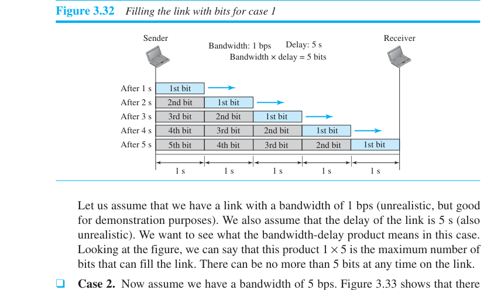
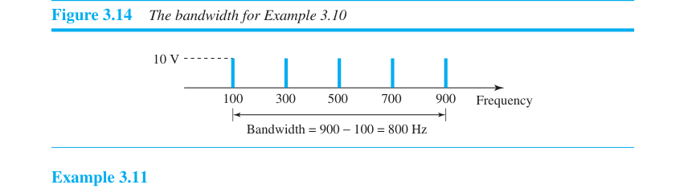
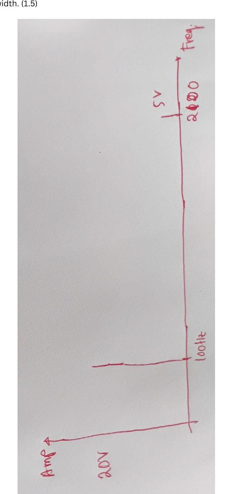
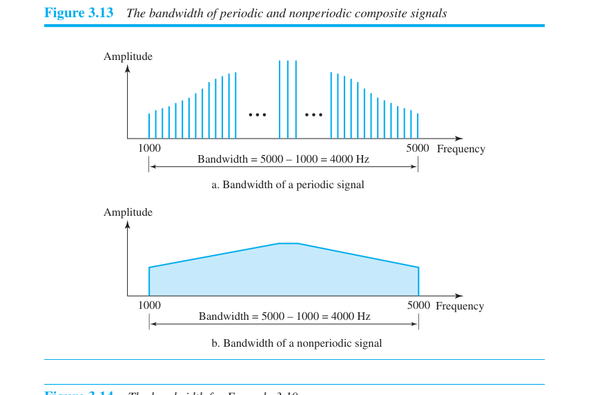

# Ch3 — Data and Signals: the math chapter (2.5 hrs, work everything by hand)

Every formula here appeared in the past paper. Verified against your PDF (printed
pages 56–89). Each section: formula → worked book example → what the exam trap is.

## 3.1 The five formulas that ARE this chapter

```
1. dB = 10 log10(P2/P1)                        attenuation/gain
2. BitRate = 2 × B × log2(L)                    Nyquist (noiseless)
3. Capacity = B × log2(1 + SNR)                 Shannon (noisy)
4. Latency = propagation + transmission + queuing + processing
   propagation = distance / speed,   transmission = message size / bandwidth
5. BDP: bits filling the link = bandwidth × delay
        full-duplex burst size  = 2 × bandwidth × delay
```

If you memorize nothing else tonight, memorize these five. Everything below is
practicing them until substitution is automatic.

---

## 3.2 Decibels (past paper Q9, Q10 — 2 marks of nearly free math)

**dB = 10 log₁₀(P₂/P₁).** Negative = attenuation (lost power), positive = gain.

**The killer property: dB values ADD across cascaded stages.** That's the whole reason
engineers use them.

### Worked (book Example 3.26): power halved
P₂ = 0.5·P₁ → 10·log₁₀(0.5) = 10·(−0.301) ≈ **−3 dB**.
**Memorize: −3 dB ⇔ half power. +3 dB ⇔ double power. ±10 dB ⇔ ×10 or ÷10.**
With just these two anchors you can sanity-check almost any dB answer.

### Worked (book Example 3.28): cascade
−3 dB, then +7 dB, then −3 dB → total = −3 + 7 − 3 = **+1 dB**. Add. Don't multiply.

### Worked (past paper Q10): three amplifiers, 4 dB each
Total = 4+4+4 = **12 dB**. "How much is the signal amplified?" — convert back:
P₂/P₁ = 10^(12/10) = 10^1.2 ≈ **15.85×**. (The paper wanted both the dB total AND the
ratio — don't stop at 12 dB.)

### Worked (past paper Q9): attenuation −10 dB, original 5 W
−10 dB ⇔ ratio 10^(−1) = 0.1 → final power = 5 × 0.1 = **0.5 W**.

### dBm variant (book Example 3.29): dBm = 10·log₁₀(P in mW)
dBm = −30 → P = 10^(−3) mW = **0.001 mW = 1 μW**. Know this exists; 30 seconds of
familiarity is enough.

### Per-km loss variant (book Example 3.30): cable −0.3 dB/km, 2 mW in, 5 km
Total loss = 5 × (−0.3) = −1.5 dB → P₂/P₁ = 10^(−0.15) ≈ 0.71 → P₂ ≈ **1.4 mW**.

**Trap:** when going from dB back to a power ratio, divide by 10 *before* exponentiating:
ratio = 10^(dB/10). Under pressure people compute 10^dB. The −3 dB ⇔ half-power anchor
catches this instantly (10^(−3) would say "one-thousandth" — obviously wrong).

---

## 3.3 SNR and SNRdB

```
SNR = avg signal power / avg noise power        (a plain ratio, unitless)
SNRdB = 10 log10(SNR)         ⇔        SNR = 10^(SNRdB/10)
```

### Worked (book Example 3.31): signal 10 mW, noise 1 μW
SNR = 10,000 μW / 1 μW = 10,000 → SNRdB = 10·log₁₀(10⁴) = **40 dB**.
**Trap: convert to the same unit first** (mW vs μW). That's the entire difficulty.

Noiseless channel: SNR = ∞, SNRdB = ∞ (book Example 3.32 — a one-line theory answer).

---

## 3.4 Nyquist bit rate (noiseless channel)

```
BitRate = 2 × B × log2(L)      B in Hz, L = number of signal levels
```

### Worked (book Example 3.34/3.35): B = 3000 Hz
- 2 levels: 2·3000·log₂2 = **6000 bps**
- 4 levels: 2·3000·log₂4 = 2·3000·2 = **12,000 bps**

### Reverse direction (book Example 3.36): need 265 kbps over 20 kHz — how many levels?
265,000 = 2·20,000·log₂L → log₂L = 6.625 → L = 2^6.625 ≈ **98.7 levels**.
Not a power of 2 → round to a practical choice and state the consequence:
**128 levels → 280 kbps; 64 levels → 240 kbps.** (Say this; it's where the marks are.)

**Theory bite the examiner loves:** increasing L raises bit rate but **reduces
reliability** — the receiver must distinguish more levels. One sentence, free mark.

---

## 3.5 Shannon capacity (noisy channel)

```
Capacity = B × log2(1 + SNR)        ← SNR is the RATIO here, not SNRdB!
```

### Worked (book Example 3.38): telephone line, B = 3000 Hz, SNR = 3162
C = 3000·log₂(3163) ≈ 3000 × 11.62 ≈ **34,860 bps ≈ 34.86 kbps**.

### SNR given in dB (book Example 3.39): SNRdB = 36, B = 2 MHz
First convert: SNR = 10^3.6 ≈ 3981. Then C = 2×10⁶ × log₂(3982) ≈ **24 Mbps**.
**Shortcut when SNR is large (book Example 3.40): C ≈ B × SNRdB / 3.**
Check: 2 MHz × 36/3 = 24 Mbps. ✓ Use the shortcut to *verify*, show the full formula
for *marks*.

**Trap:** Shannon says nothing about signal levels. If the SNR ≈ 0 (extremely noisy),
C ≈ B·log₂(1) = 0 — no data gets through regardless of bandwidth (Example 3.37).

---

## 3.6 Using BOTH limits — the past paper's Q11 was book Example 3.41 VERBATIM

> Channel: B = 1 MHz, SNR = 63. Find appropriate bit rate and signal levels.

**The two-step dance (memorize the choreography, numbers may change):**
1. **Shannon first — it sets the ceiling:**
   C = 10⁶ · log₂(1+63) = 10⁶ · log₂64 = 10⁶ · 6 = **6 Mbps**.
2. **Choose something below the ceiling for reliability** — the book picks **4 Mbps**.
3. **Nyquist second — it tells you the levels needed for that chosen rate:**
   4×10⁶ = 2 · 10⁶ · log₂L → log₂L = 2 → **L = 4 levels**.

One-liner to write in the exam (it's in a shaded box in the book, examiners love it):
> *"The Shannon capacity gives us the upper limit; the Nyquist formula tells us how
> many signal levels we need."*

Notice how friendly the numbers are: SNR = 63 → 1+63 = 64 = 2⁶. **Exam SNRs are almost
always chosen so 1+SNR is a power of 2** (7, 15, 31, 63, 127, 255...). If 1+SNR isn't a
clean power of 2, suspect you misread the question.

---

## 3.7 Performance: latency & bandwidth-delay product (past paper Q8 — 3 marks)

```
Propagation time = distance / propagation speed
Transmission time = message size / bandwidth
Latency = propagation + transmission + queuing + processing
```

### Worked (book Example 3.45): 12,000 km, speed 2.4×10⁸ m/s
t = 12,000,000 / 2.4×10⁸ = **50 ms**.

### Worked (book Examples 3.46/3.47) — which term dominates?
- 2.5 KB email over 1 Gbps: transmission = 2500·8/10⁹ = 0.02 ms ≪ propagation 50 ms
  → **propagation dominates** (short message, fat pipe).
- 5 MB image over 1 Mbps: transmission = 5×10⁶·8/10⁶ = **40 s** ≫ 50 ms
  → **transmission dominates** (long message, thin pipe).
Being able to *say which dominates and why* is a mark on its own.

### Bandwidth-delay product (past paper Q8, almost verbatim from book §3.6.4)
> Sender at 1 Mbps, link delay 5 s.
- (a) Max bits that can fill the link = bandwidth × delay = 10⁶ × 5 = **5 Mb**.
- (b) Full-duplex, send burst then wait for ack: burst = **2 × bandwidth × delay = 10 Mb**.

Mental picture (book's own): the link is a **pipe** — cross-section = bandwidth,
length = delay, volume = BDP. The ×2 in part (b) is because a full-duplex round trip
fills the pipe in both directions before the first ack can possibly return.



**Trap: units.** KB and MB in messages are ×8 to get bits; km must become m. Two of
the three "wrong answers" in this problem family are unit slips, not concept errors.

### Throughput ≠ bandwidth (book Example 3.44)
12,000 frames/min × 10,000 bits/frame / 60 s = **2 Mbps** actual throughput on a
10 Mbps link. Bandwidth = potential, throughput = actual. **Jitter** = variation in
delay between packets (matters for real-time audio/video). One line each, cheap marks.

---

## 3.8 Composite signals & bandwidth (past paper Q7, Q12 — DRAWING questions)

**Bandwidth = f_highest − f_lowest** of the components.

### Past paper Q7 pattern: three sines — 3 Hz @ 5 V, 4 Hz @ 3 V, 6 Hz @ 51 V(?)
"Draw in frequency domain" = draw a **vertical spike at each frequency, height = peak
amplitude**. Three spikes. Label both axes (freq in Hz, amplitude in V). Done. Do NOT
draw sine waves — frequency domain means spikes. This is what your answer should look
like (book Fig 3.14 — one spike per component, span-arrow underneath):



### Past paper Q12 pattern (= book-style): periodic composite, bandwidth 2000 Hz, two
sines, first at 100 Hz @ 20 V, second @ 5 V — find/draw the bandwidth
B = f_high − f_low → 2000 = f_high − 100 → **f_high = 2100 Hz.**
Draw: spike at 100 Hz (20 V), spike at 2100 Hz (5 V), mark the span "B = 2000 Hz."
The "solve" step is one subtraction; the marks are in the labeled drawing. The
handwritten model solution does exactly this (photographed sideways — tilt your head):



### Theory bites that ride along with these


- Periodic composite signal → **discrete** frequency spectrum (spikes).
  Nonperiodic signal → **continuous** spectrum.
- A digital signal is a composite analog signal with **infinite bandwidth**
  (theoretically); effective bandwidth is finite.
- Low-pass channel: band from 0 to f. Bandpass: from f₁ > 0 to f₂.
  **Baseband transmission needs a low-pass channel; modulation/broadband uses bandpass.**

---

## 3.9 Transmission impairment — 3 names, 1 line each (theory sweep)

1. **Attenuation** — loss of energy overcoming medium resistance → amplifiers, measured in dB.
2. **Distortion** — composite signal's components travel at different speeds → arrive
   with different phase offsets → shape changes.
3. **Noise** — thermal (random electron motion), induced (motors/appliances as antennas),
   crosstalk (one wire affects its neighbor), impulse (spikes from power lines/lightning).

Know which is which by *mechanism* — a favorite short question is "signal shape changed
but power fine — which impairment?" (distortion).

---

## 3.10 GAP PATCH — sine-wave basics the file skipped (10 min, added morning-of)

The past paper didn't touch §3.2, so this file skipped it. New supervisor = small risk
of a half-mark one-liner from here. Patch, in firing order:

- **A sine wave is fully described by 3 things: peak amplitude A, frequency f, phase φ**
  — s(t) = A·sin(2πft + φ). If asked "what defines a sine wave," that's the answer.
- **Period ↔ frequency: T = 1/f.** 60 Hz mains → T = 1/60 ≈ 16.7 ms. Watch units
  (ms ↔ kHz, μs ↔ MHz — inverse pairs).
- **Phase = where in the cycle the wave starts, measured against t = 0.** A shift of
  one full cycle = 360°. Classic book example: a sine starting **1/6 cycle** late →
  φ = (1/6)·360° = **60°** (= π/3 rad). The recipe: fraction of cycle × 360.
- **Wavelength λ = propagation speed / frequency = c/f.** It's "how far the signal
  travels during one period." E.g., 4 kHz signal in cable at 2×10⁸ m/s →
  λ = 2×10⁸/4000 = 50 km.
- **Bit length = propagation speed × bit duration** — the digital cousin of
  wavelength: how much cable one bit occupies.
- Frequency intuition lines the book loves: *"frequency is the rate of change";*
  instantaneous change = infinite frequency; no change at all = frequency zero (DC).
- **Time domain vs frequency domain:** a single sine = ONE spike in the frequency
  domain (at f, height A). The frequency domain is just the compact inventory of
  components — which is why composite-signal questions are drawn there.
- **Baseband vs broadband:** baseband = send the digital signal as-is, needs a
  **low-pass** channel (bandwidth starting at 0). Broadband = **modulate** onto a
  carrier, uses a **bandpass** channel. Rough baseband rule: using only the first
  harmonic, minimum bandwidth B = N/2 (bit rate N) — which is why a 4 kHz phone
  channel maxes at ~8 kbps without a modem.

## Self-test (do this closed-book at the end of the block, ~15 min)

1. Attenuation −6 dB, input 8 W. Output? *(−6 dB ≈ two halvings → 2 W)*
2. B = 5 kHz, 8 levels, noiseless. Max bit rate? *(2·5000·3 = 30 kbps)*
3. SNRdB = 30, B = 1 MHz. Capacity? *(SNR=1000, log₂1001≈9.97 → ≈10 Mbps; shortcut 1MHz×30/3 = 10 Mbps ✓)*
4. 100 km link, 2×10⁸ m/s, 10 Mbps, 1 MB file: propagation? transmission? which dominates?
   *(0.5 ms; 0.8 s; transmission)*
5. B×d product: 10 Mbps, delay 20 ms. Bits in flight? Burst size for full-duplex ack scheme?
   *(200 kb; 400 kb)*

All five right → move to Ch4. Any wrong → redo that section's worked example only.
