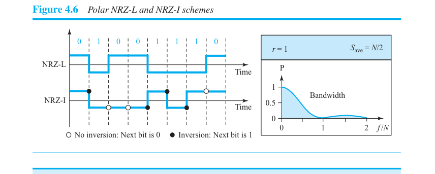
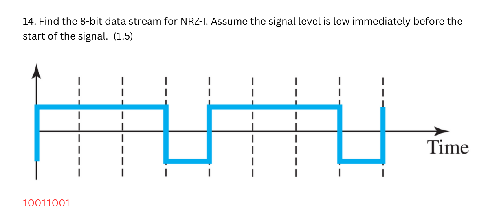
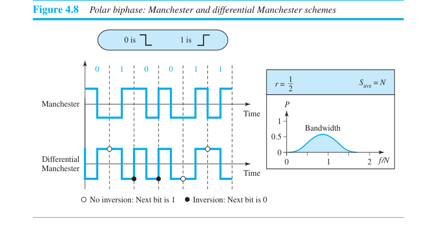
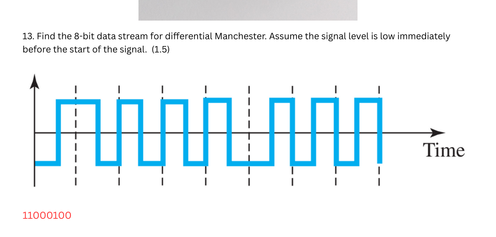
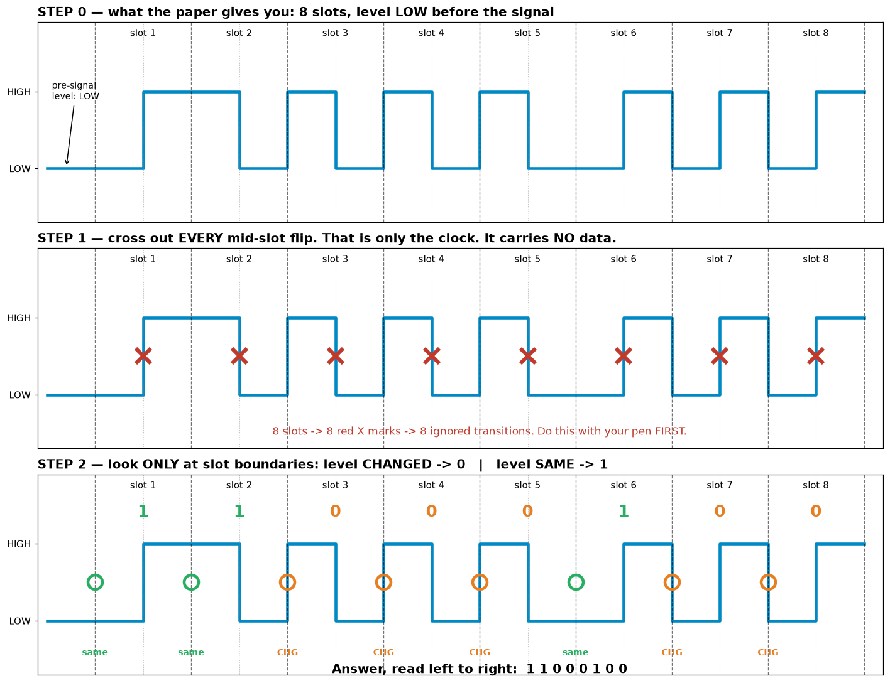
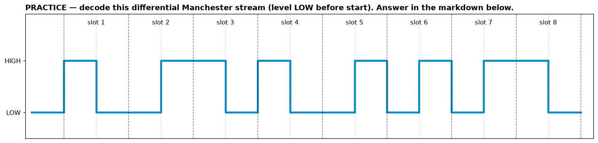
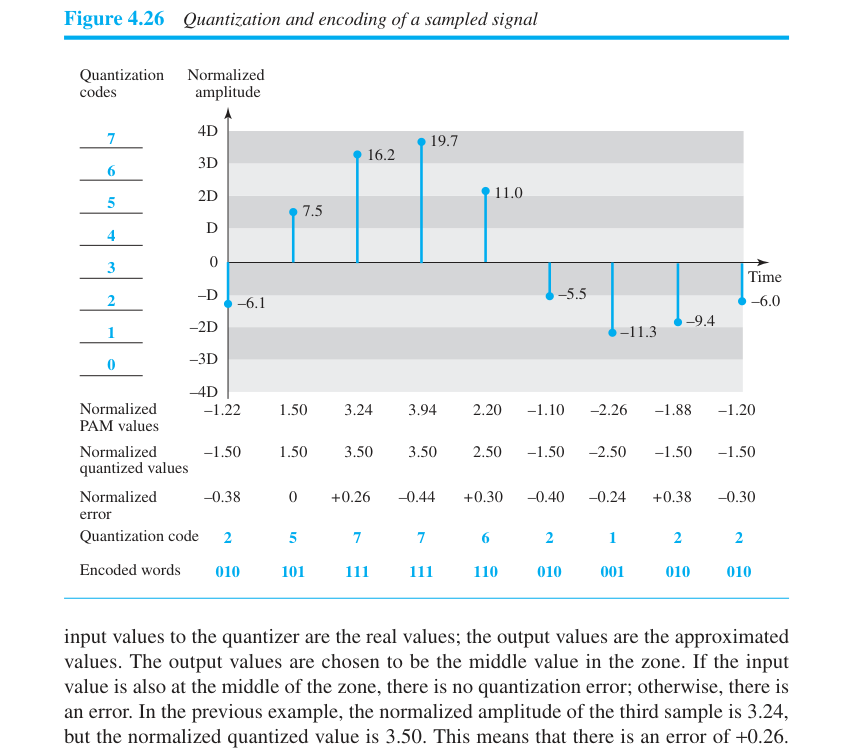
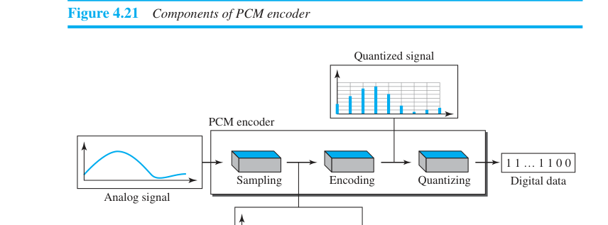

# Diagram Drills — every drawable/readable question type in Ch1–4

**The count you asked for: on the past paper, ~8 of 20 marks (40%) were diagram
questions** — Q5 (correspondence table, .5), Q7 (draw freq domain, 1), Q12 (draw
bandwidth, 1.5), Q13 (decode Diff. Manchester waveform, 1.5), Q14 (decode NRZ-I
waveform, 1.5), Q15 (OSI table, 2). None of them are hard — all six are mechanical
once you know the recipe. This file is the recipe book.

The actual rendered pages live in `figs/` — past paper pages as `pastpaper_p*.png`,
book figure pages as `b<page>_*.png`. Open them side by side with this file.

**Critical correction to file 03:** the past paper's line-coding questions are
**DECODE** questions — they *give* you the waveform and ask for the bit stream. File
03 drilled encoding (bits → waveform). You need both directions; decode is drilled
here properly.

---

## D1. Line-coding DECODE — the past paper's actual Q13/Q14 (see `figs/pastpaper_p5.png`, `p6.png`)

### The universal decode procedure (both schemes, 30 seconds each)

1. The dashed vertical lines in the figure are the **bit-slot boundaries**. Number the
   slots 1–8 above the waveform.
2. Write down the **starting level** ("low immediately before the start" — both
   questions said this).
3. Walk slot by slot asking ONE question per scheme (below), writing each bit as you go.
4. Sanity check: 8 slots → exactly 8 bits.

### NRZ-I decode rule (book Fig 4.6)

> **Transition at the start of the slot → 1. No transition → 0.**

The actual Q14 (decode this — answer in red below it):

Walk of that waveform (starts low): slot 1 jumps high → **1**; slots 2–3
stay high → **0,0**; slot 4 drops low → **1**; slot 5 jumps high → **1**; slots 6–7
stay high → **0,0**; slot 8 drops → **1**. Read-off: **10011001** ✓ (matches the key).

Notice the shape ↔ bits intuition: **long flat stretches = runs of 0s; every edge at
a boundary = a 1.** That's also *why* NRZ-I fails at self-sync for long 0s — flat line,
no clock info (nice tie-in if the question asks for a comment).

### Differential Manchester decode rule (book Fig 4.8)

> **There is ALWAYS a transition mid-slot (that's just the clock — ignore it).
> The bit lives at the START boundary: transition there → 0, no transition → 1.**

The actual Q13 (decode this — answer in red below it):

So the whole decode is: *look only at the slot boundaries, ignore every mid-slot flip.*
At each boundary, compare the level just before vs just after: changed → 0, same → 1.
Q13's waveform (starts low) reads off as **11000100** ✓.

**The full decode, as a 3-step storyboard (this is the pen procedure, drawn out):**

Step 1 is not optional ceremony — physically X-ing out the mid-flips first is what
stops your eye from reading them as data. 8 slots = exactly 8 X marks; if you have
7 or 9, you've misplaced a boundary.

**Now you, fresh waveform, no annotations (starts LOW):**

Answer (click after decoding)

**01101001** — boundary walk: CHG(0), same(1), same(1), CHG(0), same(1), CHG(0),
CHG(0), same(1). If you got the exact bit-flip (10010110), you read the mid-slot
transitions as data — go back to Step 1 and X them out first.

**The trap:** under pressure people read the mid-bit transitions as data. Physically
cover the middle of each slot with your pen tip and only look at the boundaries.

### Plain Manchester decode (fair-game variant, same figure)

> **The MID-slot transition IS the bit: low→high = 1, high→low = 0** (book 5e
> convention — but if the exam gives a legend, the legend wins).

Boundaries may or may not have transitions (they're just "resets" between equal bits) —
for plain Manchester you *ignore boundaries and read middles*: exactly the opposite
attention pattern from Differential Manchester. Say that sentence to yourself twice.

### AMI decode/encode (lower risk, 30 seconds)

0 = zero volts. 1 = alternately +V, −V, +V... Decode: every nonzero pulse is a 1, every
zero-level slot is a 0. If two *consecutive nonzero pulses have the same polarity*,
something's wrong (that pattern is actually used for error detection — bonus comment).

### Encode direction (what file 03 drilled — still fair game)

Same rules run backwards. Practice set — draw all four schemes (NRZ-L, NRZ-I,
Manchester, Diff. Manchester) for **11000100** and **10011001**, previous level low,
then decode your own drawings back. Round-trip agreement = you're done.

---

## D2. Frequency-domain drawings — past paper Q7 & Q12 (see `figs/pastpaper_p1.png`, `p5.png`, and book `figs/b066_bandwidth_ex.png`)

### The one rule that governs all of these (book Fig 3.13)

> **Periodic composite signal → DISCRETE spectrum: a vertical spike at each component
> frequency, height = peak amplitude.
> Nonperiodic signal → CONTINUOUS spectrum: a smooth curve over the band.**

Exam signals are almost always "composed of sine waves" → periodic → **spikes**.

### Q7 recipe (three sines: 3 Hz @ 5 V, 4 Hz @ 3 V, 6 Hz @ 51 V*)
1. Horizontal axis: frequency (Hz). Vertical axis: amplitude (V). LABEL BOTH.
2. One vertical spike at each frequency, height proportional to amplitude, value
   written at the top or on the axis.
3. Nothing else. No sine squiggles, no curve connecting the spikes.
(*51 V is almost certainly a typo for 5 V; draw whatever the paper says and move on.)

### Q12 recipe (bandwidth 2000 Hz, first sine 100 Hz @ 20 V, second @ 5 V)
1. **Solve first**: B = f_high − f_low → f_high = 100 + 2000 = **2100 Hz**.
2. Spike at 100 Hz, height 20 V. Spike at 2100 Hz, height 5 V.
3. **Draw the bandwidth as a labeled horizontal span-arrow between the two spikes:
   "B = 2100 − 100 = 2000 Hz."** The model solution does exactly this — the span
   annotation is what "draw the bandwidth" *means* (photographed sideways):

### The nonperiodic variant (book Example 3.12 — she could swap this in)
"Nonperiodic, B = 200 kHz, middle frequency 140 kHz at 20 V, extreme frequencies at
0 V" → smooth curve (roughly a triangle/hump): starts at (40 kHz, 0), peaks at
(140 kHz, 20 V), back to (240 kHz, 0). Continuous curve because *nonperiodic* — using
spikes here is the trap direction.

### Book Example 3.11 variant (all frequencies, same amplitude)
"Periodic, B = 20 Hz, f_high = 60 Hz, contains ALL integer frequencies of equal
amplitude" → f_low = 40 Hz; draw a comb of equal-height spikes at 40, 41, ..., 60 Hz
(literally a row of identical spikes with the span arrow underneath).

---

## D3. Table-diagrams — past paper Q5 and Q15 (see `figs/pastpaper_p1.png`, `p6.png`)

### Q5: OSI ↔ TCP/IP correspondence — the model answer is a 7-row table where
Application+Presentation+Session merge into one TCP/IP "Application" cell, Data Link +
Physical merge into "Network Access / Network Interface", Transport↔Transport,
Network↔"Internet / Network". Practice drawing the *merged-cell* shape — the merging
IS the answer:

### Q15: the model answer (worth stealing wholesale) includes **address bit-widths**:
- Port address: **16 bit** (Transport)
- Logical/IP address: **32 bit** (Network)
- Physical/MAC address: **48 bit** (Data link)
- Specific address (names) at Application; none at Physical.

And per-layer task keywords the marker was looking for: Application = DNS, DHCP, email
(SMTP/POP/IMAP), FTP, HTTP/HTTPS · Presentation = translation, compression, encryption ·
Session = session management, authentication, authorization, synchronization ·
Transport = connection control, flow & error control, segmentation & reassembly,
multiplexing · Network = providing communication channel, routing · Data link = media
access control · Physical = transmission on the line. **Add the bit-widths to your Q15
answer — it's the cheapest way to look like the model solution.**

---

## D4. Ch4 figure-reading you should recognize (lower probability, high cheapness)

- **Quantization chart (book Fig 4.26, drilled in file 03 §2.2):** the "diagram"
  version of the PCM question is a half-filled chart — samples drawn as bars, you fill
  normalized value / quantized value / error / code / encoded word rows. Same pipeline,
  presented as a figure. If you did file 03's worked skeleton, you can fill any cell.

- **PCM block diagram:** analog signal → [Sampling] → PAM → [Quantizing] → quantized
  levels → [Encoding] → digital data. Three boxes, drawable in 15 seconds, sometimes
  asked as "draw the components of a PCM encoder."

- **Bandwidth-density curves next to each line-coding scheme** (the little P vs f/N
  plots in Figs 4.6/4.8): don't memorize the shapes — memorize the one fact each shape
  encodes: NRZ family concentrates energy near f=0 (**DC problem**), biphase
  concentrates around f=N/2 (**no DC, but twice the bandwidth**). If shown the two
  curves and asked to compare, those two phrases are the full answer.

## D5. Ch1–2 sketch risk (low, but 15 seconds of insurance)

- Four topologies: practice one 10-second sketch each — mesh (5 nodes, all 10 links),
  star (hub + spokes), bus (backbone + drop lines + taps), ring (circle + repeaters).
  Label ONE advantage under each while you're at it.
- Encapsulation ladder (message→segment→datagram→frame→bits with headers stacking) —
  drawable from file 01 §2.5's chain if asked.

---

## Priority if short on time

Q13/Q14-style waveform decode is the highest-value drill here (3 marks on the past
paper, fully mechanical, and the direction file 03 didn't cover). Then Q12-style
bandwidth spans. Then the Q15 bit-widths. Everything else in this file is recognition
insurance.
