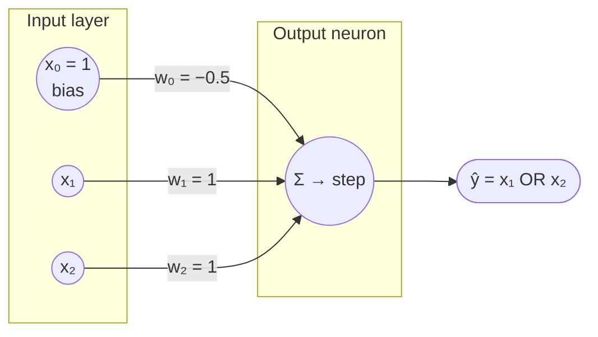
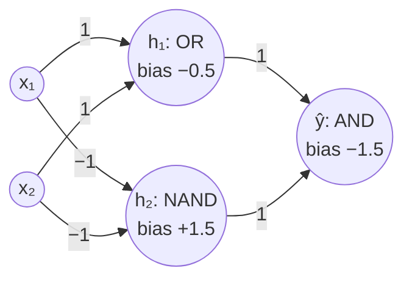

# Neural network for the OR function

> **F2021 Q5(e):** Draw a simple neural network for classifying the OR function.

**Short answer:** OR is linearly separable, so a single perceptron (no hidden layer) does it.
Use weights w₁ = w₂ = 1, bias w₀ = −0.5 and a step activation.

---

## 1. What the network must reproduce

| x₁ | x₂ | x₁ OR x₂ |
|:-:|:-:|:-:|
| 0 | 0 | **0** |
| 0 | 1 | **1** |
| 1 | 0 | **1** |
| 1 | 1 | **1** |

---

## 2. The network (draw this)



**The two equations to write under the drawing:**

$$z = w_0 + w_1x_1 + w_2x_2 = x_1 + x_2 - 0.5$$

$$\hat{y} = \text{step}(z) = \begin{cases} 1 & z > 0 \\ 0 & z \le 0 \end{cases}$$

**On paper, draw:**
- 2 input circles (x₁, x₂) and a bias input fixed at 1
- 1 output circle with Σ and a step symbol inside
- arrows from each input to the output circle, each labelled with its weight

---

## 3. Show that it works (always write this table)

| x₁ | x₂ | z = x₁ + x₂ − 0.5 | ŷ = step(z) | OR | |
|:-:|:-:|:-:|:-:|:-:|:-:|
| 0 | 0 | −0.5 | 0 | 0 | ✓ |
| 0 | 1 | 0.5 | 1 | 1 | ✓ |
| 1 | 0 | 0.5 | 1 | 1 | ✓ |
| 1 | 1 | 1.5 | 1 | 1 | ✓ |

All four rows match.

---

## 4. Why one neuron is enough

The neuron splits the plane with the line **x₁ + x₂ = 0.5**.
(0,0) falls on one side and the other three points fall on the other.

```
 x2
  1 ┤ ●           ●        ● = output 1
    │                      ○ = output 0
    │
0.5 ┤ \
    │   \     ŷ = 1 side
    │ŷ=0  \
  0 ┤ ○     \     ●
    └─┬─────┬─────┬── x1
      0    0.5    1
```

The four points can be split by a straight line, which means OR is **linearly separable**, so one perceptron is enough.

---

## 5. Likely follow-ups

**The weights aren't unique.** Any w₁, w₂ > 0 with −min(w₁, w₂) < w₀ < 0 works.
For example, w₁ = w₂ = 1 works with w₀ = −0.5 or with w₀ = −0.9.
The trained weights from section 6 (−0.5, 0.5, 0.5) sit exactly on the edge of this range (w₀ = −min). They work only if the step rule is z ≥ 0, which is why section 2 uses 1, 1, −0.5, a set that works under either rule.

**AND gate:** same network, just change the bias to w₀ = −1.5. Then only (1,1) gives z > 0 (1 + 1 − 1.5 = 0.5).

**XOR:** no single straight line separates {(0,1), (1,0)} from {(0,0), (1,1)}, so one perceptron **can't** do it.
You need a hidden layer, for example XOR = (x₁ OR x₂) AND (x₁ NAND x₂):



| x₁ | x₂ | h₁ (OR) | h₂ (NAND) | ŷ = h₁ AND h₂ | XOR |
|:-:|:-:|:-:|:-:|:-:|:-:|
| 0 | 0 | 0 | 1 | 0 | 0 ✓ |
| 0 | 1 | 1 | 1 | 1 | 1 ✓ |
| 1 | 0 | 1 | 1 | 1 | 1 ✓ |
| 1 | 1 | 1 | 0 | 0 | 0 ✓ |

---

## 6. Learning the weights instead of guessing them (η = 0.5)

Same rules as [perceptron_by_hand.md](perceptron_by_hand.md):

- Start with **w = [w₀, w₁, w₂] = [0, 0, 0]** and bias input x₀ = 1.
- z = w₀ + w₁x₁ + w₂x₂, then **ŷ = 1 if z ≥ 0, else 0**.
- Error **e = y − ŷ**, which is −1, 0 or +1.
- Update **Δwⱼ = η · e · xⱼ**. With η = 0.5 that becomes:
  - missed a 1 (e = +1): **w += 0.5·[1, x₁, x₂]**
  - false 1 (e = −1): **w −= 0.5·[1, x₁, x₂]**
  - correct (e = 0): no change
- One **epoch** = one pass over all 4 rows in order. Stop after an epoch with no mistakes.

### Epoch 1 (start w = [0, 0, 0])

| x₁ x₂ | z | ŷ | y | e | Δw | new w |
|:-:|:-:|:-:|:-:|:-:|:-:|:-:|
| 0 0 | 0 + 0 + 0 = **0** | 1 | 0 | −1 ✗ | −0.5·[1,0,0] = [−0.5, 0, 0] | **[−0.5, 0, 0]** |
| 0 1 | −0.5 + 0 + 0 = **−0.5** | 0 | 1 | +1 ✗ | +0.5·[1,0,1] = [0.5, 0, 0.5] | **[0, 0, 0.5]** |
| 1 0 | 0 + 0 + 0 = **0** | 1 | 1 | 0 ✓ | — | [0, 0, 0.5] |
| 1 1 | 0 + 0 + 0.5 = **0.5** | 1 | 1 | 0 ✓ | — | [0, 0, 0.5] |

2 mistakes, so keep going.

### Epoch 2 (start w = [0, 0, 0.5])

| x₁ x₂ | z | ŷ | y | e | Δw | new w |
|:-:|:-:|:-:|:-:|:-:|:-:|:-:|
| 0 0 | 0 + 0 + 0 = **0** | 1 | 0 | −1 ✗ | [−0.5, 0, 0] | **[−0.5, 0, 0.5]** |
| 0 1 | −0.5 + 0 + 0.5 = **0** | 1 | 1 | 0 ✓ | — | [−0.5, 0, 0.5] |
| 1 0 | −0.5 + 0 + 0 = **−0.5** | 0 | 1 | +1 ✗ | +0.5·[1,1,0] = [0.5, 0.5, 0] | **[0, 0.5, 0.5]** |
| 1 1 | 0 + 0.5 + 0.5 = **1** | 1 | 1 | 0 ✓ | — | [0, 0.5, 0.5] |

2 mistakes, so keep going.

### Epoch 3 (start w = [0, 0.5, 0.5])

| x₁ x₂ | z | ŷ | y | e | Δw | new w |
|:-:|:-:|:-:|:-:|:-:|:-:|:-:|
| 0 0 | 0 + 0 + 0 = **0** | 1 | 0 | −1 ✗ | [−0.5, 0, 0] | **[−0.5, 0.5, 0.5]** |
| 0 1 | −0.5 + 0 + 0.5 = **0** | 1 | 1 | 0 ✓ | — | [−0.5, 0.5, 0.5] |
| 1 0 | −0.5 + 0.5 + 0 = **0** | 1 | 1 | 0 ✓ | — | [−0.5, 0.5, 0.5] |
| 1 1 | −0.5 + 0.5 + 0.5 = **0.5** | 1 | 1 | 0 ✓ | — | [−0.5, 0.5, 0.5] |

1 mistake, so keep going.

### Epoch 4 (start w = [−0.5, 0.5, 0.5])

| x₁ x₂ | z | ŷ | y | |
|:-:|:-:|:-:|:-:|:-:|
| 0 0 | **−0.5** | 0 | 0 | ✓ |
| 0 1 | **0** | 1 | 1 | ✓ |
| 1 0 | **0** | 1 | 1 | ✓ |
| 1 1 | **0.5** | 1 | 1 | ✓ |

**No mistakes in a whole epoch, so training has converged.**

### Result

Weight trace: [0, 0, 0] → [0, 0, 0.5] → [0, 0.5, 0.5] → **[−0.5, 0.5, 0.5]**

So the learned neuron is **w₀ = −0.5, w₁ = 0.5, w₂ = 0.5**:

$$z = -0.5 + 0.5x_1 + 0.5x_2 \ge 0 \iff x_1 + x_2 \ge 1$$

Draw it like section 2, with the weights 0.5, 0.5 and −0.5.

**Things to notice:**
- **It's a different answer from section 2** (1, 1, −0.5), and both are correct. Many weight sets solve OR; training finds one of them.
- **(0,1) and (1,0) land exactly on z = 0.** They count as 1 only because the rule is z ≥ 0. The perceptron stops at the *first* line that works, not the safest one.
- **The rule for z = 0 changes the run.** The course slides (Ch2, slide 5) use **z ≥ 0 → fire**, which is the rule used here. Some books (e.g. Wikipedia's perceptron page) use z **>** 0 instead. With that rule training also stops at epoch 4, but the final weights are **[0, 0.5, 0.5]**. State which rule you use at the top of your answer.
- On the (0,0) row only the bias moves, because x₁ = x₂ = 0 there. (0,0) pulls w₀ down by 0.5, and each missed 1 pushes it back up by 0.5. That tug-of-war is why it takes 3 epochs for w₀ to settle at −0.5.

---

> **Doomsday version (if you only have 2 minutes)**
> 1. Draw x₁, x₂ and a bias input of 1, all going into one neuron (Σ + step).
> 2. Label the weights 1, 1 and −0.5.
> 3. Write z = x₁ + x₂ − 0.5 and ŷ = 1 if z > 0, else 0.
> 4. Write the 4-row truth table with the z values.
